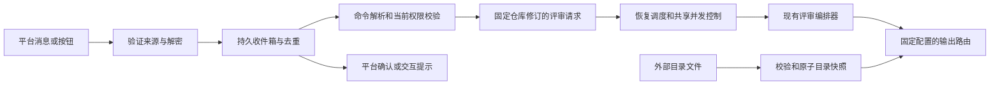

# IM 应用、回调与重新评审设计

状态：分阶段实施中，2026-09-28。IM-01/02 的配置类型和来源注册已完成；输出、回调与命令运行时仍待接线。
具体进度以 [Plan.md](../../Plan.md) 和当前代码为准；未实施的字段、接口、表和命令仍为设计目标。
开发顺序和完成条件见 [Plan.md](../../Plan.md)；外部协议依据见[来源记录](../ai/sources/im-integrations.md)。
逐步实施使用[任务卡](im-implementation.md)、[实施规范](im-implementation-spec.md)和[编号验收矩阵](im-acceptance.md)。
现有运行行为仍以[输出渠道规范](../output-channels.md)和源码为准。

## 1. 目标和范围

新增企业微信应用推送；为没有通讯录 API 的输出频道提供文件成员目录；接收企业微信应用、
企业微信 API 模式机器人和飞书应用的消息及事件。用户可查询当前会话标识，
并以消息命令或评审卡片按钮，要求对已配置仓库的指定 commit 重新评审。

`watch` 已确认为 IM 回调事件监听（@机器人的命令与按钮事件），不含仓库订阅；
长期仓库订阅的独立设计见 §10，用户已确认不纳入本次交付（2026-09-28）。
企业微信机器人按同时覆盖传统 webhook 与 API 模式确认纳入。全部能力按协议区分，不改变现有 `wecom_bot` 的含义。

### 1.1 平台能力矩阵

| 接入类型 | 推送与 @ | 消息/事件入口 | 会话标识来源与限制 |
| --- | --- | --- | --- |
| 企业微信传统 webhook，`wecom_bot` | 群推送；文件提供 userid，手机号仅用于支持该字段的文本消息 | 本次核查的 webhook 协议没有收消息入口；不可据此实现按钮回传 | URL 中的 key 是凭据，不是 chatid；可绑定管理员确认的外部会话记录 |
| 企业微信自建应用，拟新增 `wecom_app` | 应用通知到指定成员/部门/标签；另支持 appchat 群推送 | 应用接收消息、菜单事件、`template_card_event` 等，逐类适配 | 普通应用消息给出成员和 AgentID，不承诺任意群 chatid；appchat ID 来自配置或显式创建返回值 |
| 企业微信 API 模式机器人，拟新增连接 `wecom_aibot` | 被动回复及限时 `response_url`；暂不作为无限期主动推送频道 | 独立 JSON 消息与事件协议，包含模板卡片动作 | 群消息/支持的事件携带 `chatid`；单聊没有该群标识 |
| 飞书 webhook，`feishu_bot` | 群卡片推送；文件提供有效 open_id/user_id | 自定义机器人卡片支持 URL 跳转，不支持服务端请求回调 | webhook token 不能推导 chat_id |
| 飞书应用，`feishu_app` | 保留应用消息与成员 API，增加按钮动作 | `im.message.receive_v1`、`card.action.trigger`；另处理获授权的生命周期事件 | 消息中的 `chat_id`；卡片上下文 `open_chat_id`，缺失时不伪造 |

企业微信 appchat 与普通群、客户群、API 模式机器人的 chatid 分属不同接口上下文，不能互换。
应用创建/推送 appchat 要求自建应用可见范围为根部门；不自动申请这一权限，也不自动创建群。
appchat/send 的已核查类型没有交互模板卡片，群报告先用 Markdown 与命令入口；
模板卡片按钮使用支持该类型的应用通知/API 模式机器人或飞书应用路径。

### 1.2 当前源码与可复用边界

| 当前事实 | 实现与回归入口 | 对计划的影响 |
| --- | --- | --- |
| `outputChannelSchema.kind` 接受字符串，只有部分 kind 有校验和运行分支 | `packages/core/src/config.ts`；`packages/server/src/bootstrap.ts` | 新增 kind 必须贯通消费者，schema 接受不代表可用 |
| `member_directory` 只含飞书 chat_id/TTL，`user_mappings` 限制为 `ou_...` | 同上；`packages/server/test/feishu-app-publishing.test.ts` | 使用判别式目录来源及按平台校验，保留旧配置 |
| `ChannelUserDirectory` 已隔离目录与评审；目录能力目前按 kind 判断 | `packages/outputs/src/channel-identity.ts`；对应测试 | 改为按已配置来源与平台能力判定；文件目录也可供 webhook 使用 |
| 飞书目录含权限、分页、TTL 和专用身份模型处理 | `feishu-app.ts`、`feishu-members.ts`、`packages/server/src/author-identity.ts` | 复用匹配顺序和隐私边界，文件不套用远端 API 的 TTL |
| 企业微信 webhook 发布 Markdown，手机号字段当前放在 markdown 对象内，未检查业务 errcode | `packages/outputs/src/index.ts` 的 `createWeComBotDispatcher` | P1/P2 内核对并修正相关 payload，不把当前实现当作官方协议 |
| 自动提交接收与死批次重启已有持久协议 | `auto-commit-runtime.ts`、`observability-api.ts`、`review-deduplicator.ts` | 新评审请求需要独立身份，不回放旧 webhook 或重置自动流游标 |
| 队列支持确定性 job ID；普通 worker 依赖注入 jobHandler | `packages/core/src/queue.ts`、`queue-worker.ts`；server `runtime-queue.ts`、bootstrap | 需要补齐实际消费与持久交接，不能仅 enqueue 后宣称实现 |
| 配置 generation 有租约、持久 pin 和排空 | `runtime-config.ts`、`runtime-generation.test.ts` | 新连接、目录资源、任务和回调密钥都要明确生命周期 |
| 发布日志保留远端身份；未知 webhook 写入不能盲重发 | `publication-journal.ts` 及测试；`auto-commit-runtime.test.ts` | 新应用发送和命令反馈均需描述发送中断边界 |

本次在 `packages` 内搜索没有找到现成通用文件 watch 实现。目录监视器作为独立宿主资源设计，
不要求重新加载整个应用配置。当前八个无关工作区修改不在此次计划文档修改范围。

## 2. 组件与配置所有权



拟新增 `im.connections` 命名映射，管理 `wecom_app`、`wecom_aibot`、`feishu_app` 的身份与回调密钥。
输出频道通过 `connection` 引用连接，命令策略通过 `im.command_bindings` 引用同一连接。
这种分离允许仅接收消息的连接，避免在多个输出频道中复制回调凭据。
代价是增加配置实体及管理 UI；P0 必须同步配置实体注册、来源合并、迁移、预览、凭据规则和删除引用校验。

| 拟新增位置 | 约定 |
| --- | --- |
| `im.connections.<name>.kind` | 三种明确的接入协议；默认不启用入站 |
| 企业微信应用身份 | `corp_id`、`agent_id`、`app_secret` 或 `app_secret_env`；应用 secret 与通讯录专用 secret 不混用 |
| 飞书应用身份 | `app_id`、`app_secret` 或 `app_secret_env`、允许的 `tenant_key` 和官方 API origin |
| 机器人身份 | `aibot_id`、本地明确的企业/机器人身份命名空间；回调用户可能是加密 userid |
| `callback` | `enabled`、协议所需 token/AES key 或 Verification Token/Encrypt Key；literal 与 `_env` 互斥 |
| `outputs.channels[].connection` | 类型必须相容；旧 `feishu_app` 内联凭据继续有效，内联与引用不能同时配置 |
| 企业微信应用 `target` | `kind: recipients` 对应显式 `users/parties/tags`，或 `kind: appchat` 对应 `chat_id`，二选一 |
| `im.command_bindings` | 缺省 disabled；明确 connection、会话范围、原生操作人 ID、允许命令、仓库别名及 workspace_routes 策略；重叠 enabled binding 拒绝 |
| 文件目录 | 沿用 `member_directory` 字段，详见[目录设计](member-directory.md) |

旧飞书目录 `{chat_id, cache_ttl_seconds}` 继续解释为 API 目录；不默默切换到文件。
新增凭据遵守现有加密密封、脱敏、secret policy 和 generation 规则。
文件目录内容及回调临时凭证不进入配置快照；路径和安全策略可以进入。
连接身份或平台类型变更视为新身份命名空间，不能沿用原 token、去重记录或会话授权。

## 3. 企业微信应用发送

新增 `WeComAppClient` 与 dispatcher，在 server bootstrap 和模板选择处接线。
复用现有问题聚合、目标链接、`no_problems`、模板优先级和 `{{atMentions}}`，
同时按 API 类型选择渲染器；不能把普通 Markdown 标记当作真实通知。

- Token 按企业、应用和凭据版本隔离，缓存服务端 `expires_in`，提前刷新且并发只取一次。
  只有明确 token 失效业务码可刷新后重试一次；超时、连接断开不能证明消息未送达。
  P0 从官方返回码表固化白名单，未知码不推测为可重试。
- 应用通知调用 `message/send`，群推送调用 `appchat/send`。二者独立 payload、上限和功能表。
  token 在请求参数中时，日志、指标、异常和 HTTP tracing 必须去掉查询凭据。
  只允许已验证官方 origin；测试用注入 transport，不开放聊天输入指定 API 地址。
- 首期提供 text、Markdown 和应用通知的按钮模板卡片；不增加无需求的媒体上传。
  `recipients` 是投递目标，群内 @ 是消息能力；部门/标签通知不声称逐人成员 @ 已送达。
  按 UTF-8 字节限制和平台结构截断/拆分，拆分记录逐条序号与发送回执。
- 检查 HTTP 状态及 `errcode`，将无效/无许可收件人分类为部分失败；保留成功发送证据。
  不对完整收件人集合重发来补偿部分失败。展示脱敏计数和管理员可见的受限诊断。
- 应用的内容重复检查是有限时间内的辅助机制，不是通用请求幂等键。
  发送前保存 operation 身份；丢失响应时保留 `unknown`，未经核验的查询/幂等协议不得授权重发。
  更新卡片的 response code 与机器人 response_url 分别建模，不互用有效期或使用次数。
- 使用按应用、接收人/群、连接的有界发送队列；遵守对应官方限速与明确的限流返回码。
  输出重试不得引起整次 LLM 重新评审。统一应用 client 与 webhook 的业务错误分类测试。

企业微信通讯录 API 自动同步不作为发送能力的前置要求；首期企业微信身份关联使用文件或明确映射，
避免强制扩大通讯录权限。真实租户的可见范围、许可和发送 API 网络要求纳入 P6。

## 4. 文件成员目录

[成员目录设计](member-directory.md)定义 YAML/JSON schema、命名空间、匹配优先级及 watch/reload。
文件负责平台身份和显示资料，不能赋予重新评审权限、增加输出目的地或提供回调 URL。
飞书应用可在 API 与文件间显式选择；首期不隐式合并两个目录，以免失去完整性及删除语义。

## 5. 回调接收与安全

拟提供 `GET/POST /callbacks/im/:connection`。企业微信 GET 用于 URL 校验，POST 接收消息/事件；
飞书 POST 同时识别 URL verification、消息事件和卡片回调。路由从服务端连接表选择协议和密钥，
不由未验证 payload 指定。callbacks 使用平台鉴权，不要求平台携带管理员 session。
全局中间件、反向代理和 body parser 必须保留原始字节，并设置独立的体积/耗时/限流边界。

### 5.1 协议适配

| 平台 | 认证和消息处理 | 确认及去重 |
| --- | --- | --- |
| 企业微信应用 | 校验 `msg_signature` 后解密，校验接收企业与 AgentID；首期 XML，禁用外部实体/DTD | 验证地址 1 秒内返回明文；普通回调 5 秒内确认，平台失败重试三次；优先 MsgId |
| 企业微信 API 模式机器人 | 独立适配加密 JSON；官方样例的 receiveid 为空，解密后另校验配置 aibotid | 按回调 `msgid` 去重，消息和 stream 刷新分型；stream 刷新不产生新评审 |
| 飞书应用 | 校验原始 body 签名、解密，核对 token/app_id/tenant_key；URL 验证按专用协议处理 | URL challenge 1 秒；消息事件/卡片回调 3 秒；消息使用 message_id，卡片使用 event_id 加动作身份 |

实现目标为持久写入加确认在 1 秒以内，并有超时预算；具体平台硬限制独立测试。
飞书卡片不提供事件式补推，超时不能提示用户“平台一定会重试”。
签名比较恒定时间；正常业务回调校验签名时间窗（拟 5 分钟），区分请求投递时间与原始事件时间，
不能因消息较旧就拒绝平台的合法补推。真实补推 fixture 若表明请求签名复用旧时间，须先调整策略和测试。

飞书 URL challenge 可不带普通事件签名；要求配置密钥解密（若加密）并验证 Verification Token，
不对业务事件复用这一例外。首期生产 HTTP 接入要求 Encrypt Key 和签名验证，
没有签名的 token-only 接入不进入业务命令路径。
企业微信机器人加解密页未取得正文，但已从官方概述的下载链接读取 Python 3 样例：
GET 验证和 POST 解密均使用空 receiveid，不能替换为应用 CorpID。
入站 JSON 从 `encrypt` 取密文；回复 envelope 为 `encrypt/msgsignature/timestamp/nonce`。
协议使用排序后的 token、timestamp、nonce、密文计算 SHA-1，AES-CBC 解密后检查长度、填充和接收方。
实现采用平台协议测试向量、严格格式校验与系统密码学随机数，不照搬样例的调试日志或依赖。
P0/P3 仍需编写正反向测试并以真实 URL 验证验收；本轮没有执行样例或加解密测试。

### 5.2 事件归一化与持久接收

新增 `VerifiedImEvent`，保留 connection/身份命名空间、actor 原生 ID 与类型、事件/消息 ID、
会话类型/ID、事件时间及有限的命令/动作字段；该类型只可由认证成功的适配器构造。
忽略机器人自己的消息、其他机器人消息及未支持的内容类型，防止循环触发；
群命令默认要求明确 @当前机器人或有效按钮，不申请全群聊天读取权限。

持久收件箱采用 `(connection_identity, delivery_kind, delivery_key)` 唯一约束。
企业微信应用无 MsgId 的事件使用企业/应用、FromUserName、CreateTime、Event、EventKey、
TaskId 和相关动作字段的规范化摘要；不能只拼发送人和秒级时间而吞掉不同按钮。
飞书消息遵守 message_id 去重，不只用 event_id。

- 收件箱先写入并固定 request ID，再确认平台收到。短事务中不做 VCS、LLM 或远端发消息。
- 同一唯一键但不同内容摘要作为冲突处理，不执行第二次；已记录的重复投递返回原请求状态。
- 存储不可用返回平台规定的失败响应；卡片明确提示稍后重试，不返回虚假的成功 toast。
  写入结果不确定时按唯一键查询并恢复，用户重试同一按钮使用同一业务动作身份。
- 只保存处理命令所需字段，原始完整聊天记录默认不落库；普通无关消息不保留正文。
  消息内容、目录、手机号、token、response_url 不进日志或主评审 prompt。
- 对无害但未知的合法事件确认并记录受限计数，避免无限重试；明确的移除、撤销授权事件使连接/会话失效。
  获得何种生命周期事件就处理何种，不宣称平台会通知所有权限变化；执行前仍检查当前授权。
- 收件箱和动作去重保留期拟 7 天，长于已核查补推窗口；活动任务和未决发送记录不随 TTL 删除。
  保留期是本地设计值，不是平台承诺，迁移/清理测试覆盖唯一键与 tombstone。

### 5.3 HTTP 与长连接的取舍

首期采用 HTTP，与当前 Hono 服务及企业微信回调部署一致；通过 TLS 反向代理接入。
飞书官方 SDK 长连接适合无公网入口的自建应用，事件与新卡片回调均有官方入口；
后续可作为可选 transport，复用相同认证后事件、收件箱和命令服务。
首期不同时接入多种 transport；不能以“飞书没有长连接卡片回调”解释这一取舍。

## 6. 会话发现与命令授权

`aicr chat-id` 返回当前平台原生会话标识及其类型；只有已允许的操作人可查询。
普通企业微信应用单聊只返回应用和成员上下文，明确没有群 chatid，不伪造一个群标识。
API 模式机器人单聊同样不伪造群 ID；可以显示本地不透明的会话引用，但标注不能用于 appchat/send。
飞书返回当前 `chat_id`；卡片上下文缺失时仅使用已验证的原始发送记录关联，不信任用户填写的 chat_id。

`ConversationRegistry` 保存连接作用域下已验证会话的发现时间、可用能力和状态。
管理员可在受现有认证保护的只读 API/页面复制会话 ID；不在未知群自动展示仓库清单。
发现记录不自动写入输出配置、不自动扩充命令绑定。普通 webhook 只能由管理员显式绑定，不能扫描 key 找群。

命令授权取以下交集：启用的连接、会话 allowlist、原生操作人 allowlist、允许命令、仓库别名映射。
首期不将“在群内”视作所有仓库的权限，不使用目录中的姓名/邮箱匹配或 LLM 来授权。
用户 ID 必须带类型及租户/应用命名空间；API 模式机器人的加密 userid 不直接等同应用 userid。
授权需要复用身份时，只使用官方明确的转换或管理员配置的精确关联。

仓库别名解析为已配置的 `source_trigger + workspace + repo_ref`。
绑定校验必须证明三者相容；v2 路由和多仓库 workspace 继续做现有范围解析。
未映射的仓库 URL、任意工作目录、shell 参数、模型、输出目的地均不可由聊天输入传入。
拒绝响应只说明“目标不可用或未授权”，不泄露私有仓库是否存在。

## 7. 指定提交重新评审

### 7.1 用户交互约定

首期固定语法，无自然语言执行器：

```text
aicr help
aicr chat-id
aicr review <repo-alias> <revision>
aicr status <request-id>
```

每个请求限定一个已授权仓库和一个修订；用户可对多个仓库分别发命令。
`review` 表示重新计算一次评审，包含已完成的 commit；每次新消息产生独立 request ID，受冷却/配额约束。
重复平台投递不产生新请求。运行中的同目标请求返回活动 request ID，避免同时重复工作；
完成后新的显式命令可以再运行。目标锁以可信仓库、workspace、固定 revision 为键，
事务或 CAS 原子地关联活动 request，避免同时到达的两个新命令穿透去重。
不提供绕过授权、并发、时间窗口或用量限制的 `force`。

飞书应用和企业微信受支持的模板卡片增加“重新评审本次提交”按钮。
服务器在发送前创建短期动作记录（拟有效 24 小时），按钮仅携带随机不透明 action ID；
记录绑定原消息/TaskId、连接、会话或应用接收人、仓库、固定 revision、允许的动作与过期时间。
收到回调时重新鉴权并核对这些字段，CAS 将动作变为 consumed，重复点击返回同一 request ID。
一个群共享动作首次成功消费后即固定请求；再次评审使用新命令或新动作。
不接受按钮自带的任意仓库 URL、commit 替换值、命令、reply URL 或权限列表。
引用旧评审结果的按钮固定原 revision，但新请求使用接收时的当前执行配置。

### 7.2 修订解析和 ReviewEvent

| VCS | 首期支持与拒绝边界 |
| --- | --- |
| Git / GitHub / Gitea / Forgejo / GitLab | 精确完整 commit object ID，长度按仓库对象格式校验；不接受分支、tag、范围、`HEAD` 或可歧义短 SHA。通过现有 VCS adapter 校验对象属于允许仓库/可达范围，使用该 commit 对父提交的差异 |
| Git merge/root commit | merge 默认第一父提交，响应中说明比较基线；root 与空树比较；若对应 adapter 缺少证明能力，明确拒绝且补实现任务，不偷偷改为最近 push 范围 |
| P4 | 正整数且已提交的 changelist，使用原 workspace/source scope；拒绝 pending/shelved 与跨 depot 未授权范围 |
| SVN | 正整数 revision，可接受 rN 写法并规范化为 N；与 r-1 比较且限定配置路径；该路径无变化时返回无可评审改动；不把全仓 revision 视为全路径授权 |

可信 VCS 元数据提供提交作者、基线、链接、标题及 diff。IM 操作人只进入独立 `requestedBy` 审计字段，
不覆盖 `ReviewEvent.author`，也不授予被 @作者更多权限。
事件 provider 保留 VCS 家族，不将所有请求设为 `provider: manual` 导致 adapter 丢失 VCS 类型。
增加明确的触发来源元数据 `im_command`，目标为 `commit`；配置的 VCS trigger 继续提供凭据和路由。
在自动提交分类前排除这类命令，防止进入 push 扩展、reviewed 去重或 stream 游标推进。

### 7.3 持久任务与恢复

新增宿主侧 `ManualReviewService`，供消息、按钮和未来管理员入口复用，
不从聊天调用现有管理员 retry HTTP API。现有 retry 只重启 dead/skipped 自动批次，语义不同。

拟新增 `im_inbox`、`im_actions`、`im_review_requests` 及会话记录，落在现有关系型 store 的迁移体系，
支持 SQLite 和 PostgreSQL。收件箱写入与待处理请求在同一事务中，约束保证重复请求只分配一次 ID。
启用可执行命令同时要求关系型 StoreDb 和 `config_sources.database.enabled: true` 的持久 ConfigStore，
确保接收时有非空 snapshot ID。file-only 的 runtime generation 当前返回 null snapshot，首期不另建快照格式。
命令 worker、加密密钥和协议适配器未就绪时拒绝启用 review；推送和文件目录不受此命令前提限制。

工作状态：`accepted → validating → queued → running → publishing`，
终态区分 succeeded/partial/publication_unknown/failed/rejected，另有携带 resumePhase 的 retry_wait。
完整转换表以[实施规范](im-implementation-spec.md#5-请求状态与队列恢复)为准；accepted 尚未证明 commit 可执行。
租约、CAS fencing、尝试次数和恢复时间写入请求记录，停机先停止领取并排空，再关闭 store。

使用现有 ReviewQueue 作为唤醒/分发机制，job ID 为 `im-review-<requestId>-<dispatchSeq>`；
同一次交接重投保持同一 ID，后续尝试递增序号，避免旧 completed job 吞掉重试。
持久请求表为恢复真相源，启动及周期扫描补发遗失 job。对 enqueue 成功但本地标记失败反向核验，
完成 job 后丢失确认也不能重新启动已完成请求。补齐 bootstrap 实际 jobHandler 路由；
不把内存队列、Redis 队列或独立数据库之间的写入描述为原子事务。
执行前由请求行租约确认唯一所有者并共享 `ExecutionConcurrency`，不另开不受控的 fire-and-forget worker。

接收时固定执行配置 snapshot；排队期间的撤权/停用是即时安全边界，执行前用当前策略再次校验。
已获准任务的模型、输出与工作路径仍用固定 generation；使用当前权限并不允许重新路由到另一个仓库。
按钮和请求保留 generation pin 到终态/清理，路径、schema、敏感字段和 GC 均需新旧版本测试。

重试请求沿用 request/run ID，显式新请求分配新 run ID。
分析完成后保存发布状态，复用并扩展 PublicationJournal 的逐渠道恢复；
发布失败优先续发可证明未送达的操作，不重新调用 LLM。未知远端写入保留 unknown 并显示受限诊断。
不为重新评审删除旧 run、问题记录或历史用量；问题生命周期继续遵守覆盖范围和模型确认规则。

### 7.4 回复、路由与防滥用

协议 ACK、命令 accepted 提示、最终报告是三个不同状态。
平台回调时间预算内最多做本地持久写入和提示；VCS、LLM、远端卡片更新全部在后台完成。
飞书卡片 toast 返回请求编号；普通消息用受控响应通道发状态。
企业微信机器人优先用被动回复给出 accepted/request ID，把一次性 response_url 留给最终状态。
超过其 1 小时有效期时，保留可查状态并使用已配置固定输出，不能把 response_url 当作永久 webhook。

临时回复 URL 仅可来自认证成功的回调，校验 HTTPS、官方 host/精确路径，禁跳转；
需跨进程使用时加密保存、到期清理、发送前标记占用。发送结果不确定后不再次消费一次性 URL。
飞书卡片更新 token 的 30 分钟/两次限制同样不能承载无限期任务状态。
应用主动消息和固定输出频道承担长任务报告；没有这一能力时，接受前向用户说明最终结果查询方式。

默认最终报告走 workspace 已批准输出路由；源会话仅收到编号和状态，不自动转发私有完整报告。
首期只支持 `report_policy: workspace_routes`，完整报告的动态源会话转发另行设计。
`status` 也要校验请求人的仓库权限和会话范围，管理员链接继续受管理员认证保护。
按操作人、会话、仓库设置限额与冷却，绑定现有预算限制；有界队列超限明确拒绝。
不将通知重试计为新的评审，也不允许动作凭证替代当前操作人授权。

## 8. 测试与验收

| 领域 | 必须覆盖的可观察结果 |
| --- | --- |
| 配置 | 旧飞书内联配置、API 目录兼容；新连接引用/类型/secret 互斥；文件/数据库发布、恢复、预览、UI 表单和凭据脱敏 |
| 应用发送 | token 并发与隔离、部分成功、errcode、每种 target 的真实请求形状、UTF-8 边界、限流、丢失响应、拆分与混合输出 |
| 目录 | 见独立目录文档；断言真实 publisher payload，不只测解析函数 |
| 回调 | 官方加解密向量、GET/challenge、错签名/租户/app/接收人、过大/畸形 XML/JSON、XXE、时间窗、正文空格变化、类型分流 |
| 去重与安全 | 消息重复、动作并发、同秒不同事件、相同 key 不同内容、跨租户 ID、过期动作、转发卡片、权限撤销、机器人循环 |
| 请求执行 | Git 根/merge/完整 SHA、P4/SVN 修订、未授权仓库、作者与请求人分离、已完成提交重新评审、自动流不变 |
| 持久恢复 | 写库前/后 crash、ACK 丢失、enqueue 前后 crash、多实例租约、执行/发布中断、重启新 store 对象、GC 和升级迁移 |
| 组合边界 | 旧任务+新配置、旧动作+撤权、文件目录变更+发布恢复、过期 response_url、队列满/预算耗尽、停机排空 |
| 真实账户 | 三种回调、各实际目标发送、原生 @和会话 ID、命令/按钮触发合成 commit，记录账户权限与版本限制 |

本地实现阶段按[仓库基线](../ai/AGENTS.repository-baseline.md)运行完整 runtime sequence；
变更管理 UI 时加浏览器门禁；涉及存储时加真实 SQLite/PG 及实际采用队列后端的恢复/迁移测试。
真实平台/LLM 验收独立授权、环境变量门控、限量和清理；全不设才跳过，部分配置失败。
mock、签名 fixture 和本地回环不能当作真实群 @或平台回调成功的证据。

## 9. 实施时的文档与 AI 同步

| 表面 | 更新时点 |
| --- | --- |
| `docs/output-channels.md`、架构输出/触发/配置/存储章节 | 对应实现通过后写当前稳定约定，包含应用目标与回调恢复边界 |
| `docs/site/src/content/docs/{en,zh-cn}/configuration/outputs.md` | 应用配置、目录与 @、平台能力差异；两种语言同时修改 |
| 双语配置 overview、字段参考、触发说明、dashboard、operations | 新实体/字段/端点/权限/命令/观测指标出现时同步；执行 docs build/check |
| `example/config.yaml`、`example/README.md` 和目录示例 | 功能可运行后加入最小配置与加载测试；现在只有独立草案示例 |
| `output-channel-contracts` skill 及 IM reference | 按实现增加文件目录、回调和来源入口；不把提案写成已实现约束 |
| `packages/server/src/author-identity.ts` | 仅在扩大候选结构时调整专用提示词与装配测试；主评审 prompt 不接收目录或聊天命令 |
| `docs/ai/index.md` 与 Plan | 保留未完事项和验收边界；完成后迁移稳定约定与证据，退役任务设计 |

本轮不改双语当前功能页面、运行时 prompt 或可运行配置，因为能力尚未实现；
不新增需要主评审 agent 理解聊天权限的 skill。此次只为未来实施建立条件导航和官方证据入口。

## 10. 已确认边界与扩展草案

- watch 长期订阅（已确认不纳入本次交付，2026-09-28）：若将来纳入，新增独立的
  `watch/unwatch/list` 命令、持久订阅表及终态通知 outbox，
  以仓库/授权会话/订阅者为键；只订阅原有评审事件，不启动第二套仓库抓取或自动评审。
  创建和投递时均校验权限，退出群/撤权后停发，事件 ID 去重、静默窗口与退订数据清理另设验收。
  完整报告仍受路由与可见性限制。本条仅保留为将来扩展的设计草案。
- API 模式机器人 receiveid/URL 校验/被动回复使用已核查官方样例建立 P0 测试向量，
  P6 验证实际回包；样例阅读不等于协议测试通过。
- 测试凭据与环境补充（2026-09-28）：本地 `development/secret/secret.yaml` 提供
  webhook（`wxwork_robot.webhook`）与应用（`wxwork_app.{corp_id,agent_id,secret}`，
  corp_id 当日补齐）凭据；智能机器人为**长连接模式**（仅
  `wxwork_airobot_conn.{bot_id,secret}`，无回调 token/AES），首期 HTTP 回调的
  wecom_aibot 路径在该租户保持 pending_external，除非改配回调模式。
  测试应用与机器人已授予通讯录根权限，appchat 前提成立；IM-21 不验证权限受限
  负路径。智能机器人已补事件回调模式凭据（`wxwork_airobot_event_callback.{token,secret}`），
  HTTP 回调路径可实测；长连接凭据仅作参考。变量登记见[服务指南](../testing-services.md)。
- 实施环境已确认（2026-09-28，同日更新）：应用发送以 message/send 成员通知
  （recipients）为主路径；测试应用已获通讯录根权限，appchat 前提成立
  （其 schema、client 与 dispatcher 已随 IM-04/05 实现，O02 以注入 transport 验证），
  真实 appchat 验收在有本应用创建的群时进行。IM-21 不验证权限受限负路径
  （无许可收件人、受限可见范围）。飞书为境内版；Lark 仅入口域名与账号体系不同，
  仓库现行合同将两域名视为同一 API 形态（`feishu-app.ts` 双域名校验，来源记录以
  larksuite 官方 SDK 核对过境内契约），`base_url` 已可配置，测试只覆盖境内，
  启用 Lark 前按来源记录复核。公网 HTTPS 回调入口为 `https://aicr.x-ha.com/`，
  回调路由挂在其 `server.path_prefix` 前缀之后（IM-12）。
- 单个请求支持一个 revision；跨仓库批量命令、PR/MR 重新评审、任意自然语言代理、
  会话存档/全群监听、自动建群和第三方多租户应用不在本次首期范围。
