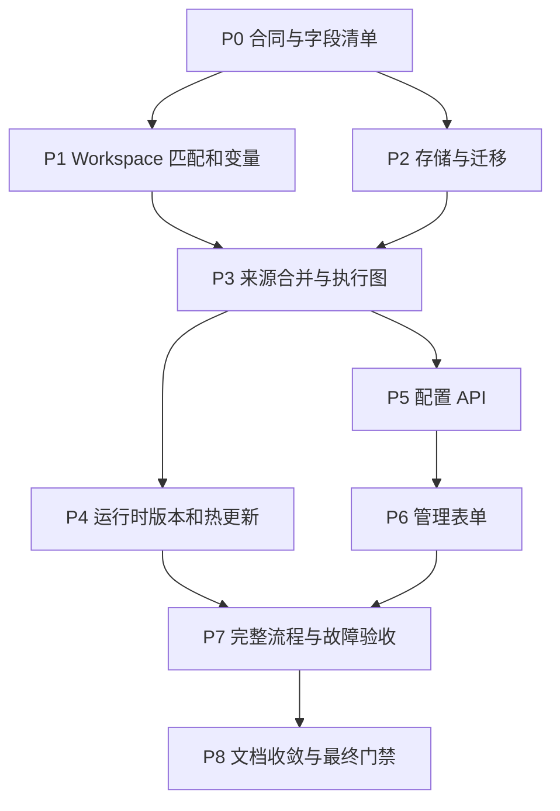

# Workspace 与动态配置执行计划

状态:P0–P3 已完成实现与验收(P2 证据见 [M17](../../ai/milestones/M17.md) 与架构 §3.14,P3 见 [M18](../../ai/milestones/M18.md) 与架构 §3.15)。workspace 级 agent/sandbox 配置覆盖仍按原计划在 P4 接线,P4–P8 待推进。 设计合同见
[详细设计](../specs/2026-09-11-workspace-config-management.md)，测试 ID 和后端证据要求见
[测试计划](2026-09-11-workspace-config-tests.md)。任何复选框只有实现、对应测试和适用最终门禁通过后才能勾选。

## 1. 执行约束与依赖

原设计源码基线为 `e609cd7`。当前已实施并审查 P0 与 P1；继续实施前重新检查 `git status`、schema、bootstrap、调用方和相关测试，保留已有工作区修改。本轮未运行数据库迁移，未部署服务。

默认设计：文件显式配置优先并锁定；数据库提供补充来源；发布后新接收任务生效，已接收任务固定版本；新规则使用隔离目录布局，旧绑定保留兼容布局。改变其中任一合同必须同步设计、测试矩阵及示例，不能靠实现中的 fallback 决定。

P1/P2 在合同确定后可独立推进；P4/P5 共享发布和 snapshot 合同，不能各自定义 revision。此图描述代码依赖，不要求本轮或后续自动启动并行 agent。

## 2. 阶段清单

### P0. 配置合同与兼容输入

- [x] 从 `packages/core/src/config.ts` 导出可复用组件 schema，保持 Zod 3、现有默认值和已废弃字段拒绝行为。组件 schema 已从原内联定义提取并导出，默认值由兼容测试校验。
- [x] 建立永久字段清单：path、kind、default、source ownership、inheritance、capability、resolver、consumer、UI control、test ID。逐项覆盖 provider、model groups/overrides、trigger、channel、route、agent/search/sandbox、review、workspace。字段清单位于 `packages/core/src/config-components.ts`，U24 纯层门禁对照 Zod walker 检查声明字段、默认值及实体所有权；字段上的 test ID 是验收目标，不代表已经通过。
- [x] 补全 `triggers`/outputs/providers 的 passthrough 字段类型和 kind 能力校验。（`config-capabilities.ts`：`validateDatabaseDocument` 发布路径上的类型化 DTO + kind×字段能力矩阵，9 种 channel kind、provider 连接字段归组、`resolved_action` 逐 kind 取值，错误码 `invalid_field_type`/`unsupported_capability`；未知扩展键保留不拒绝。）
- [x] 建立 raw config source 文档和文件位置模型，将读取原文、旧版本转换、填默认值和最终 schema parse 分开。(`config-source.ts` 的 `parseRawConfigSource` + `config.ts` 的 `parseConfigDocumentText` 管线；`loadConfigFile` 经同一管线，重复键拒绝、别名内存转换。)
- [x] 为现版 `source_repo`、`repos[].match`、outputs route 顺序、空数组和默认 workspace 行为保存独立兼容 fixtures。静态输入位于 `test/fixtures/config/`；文件名 b01–b05 只是 fixture 编号，不对应测试矩阵 B01–B05 的完整验收。
- [x] 固定未来配置 `formatVersion`、revision API、错误码、matcher/helper 语言和实例 identity 合同，形成纯类型和验证函数。(`config-format.ts`：错误码、实体注册表、revision/namespace/generation 校验、stable hash、matcher 白名单、workspace instance identity。)
- [x] 清点 `review` 中 schema-only 与实际接线字段；将本次必须支持的全局 Review 字段分配到 P4，不留下"表单可保存但运行无效"。(清单逐字段标 wired；schema-only 项带 P4/P1 状态注记，禁入 UI。)

当前影响：`packages/core/src/config.ts`、`index.ts`、新增 `config-source.ts`、`config-format.ts`、`config-components.ts` 及相应 `packages/core/test/`。`review-event.ts` 的多工程接线留在 P1，不新建 pnpm package。

退出条件：完成本阶段字段合同及纯层回归，并通过适用最终门禁；依赖存储、API、运行时的 F/C/B 验收随宿主阶段完成，不把纯函数通过写成整项验收通过。

P0 审查已补充转换失败不修改输入、模型组数组 CRUD/投影、记录 ID 一致性、父子路径文件锁、原型键写前拒绝、原子数组、无效实体保留、shadowed 字段视图、YAML 循环/重复键、路径转义、哈希与 snapshot 边界。具体证据与剩余阶段见[测试计划 §1](2026-09-11-workspace-config-tests.md#1-测试组织与证据)。

### P1. Workspace 匹配、来源变量和目录

- [x] 将现有 RE2/glob 编译抽成最小共享函数，保留 `auto-commit-exclusion` 行为；新增 exact matcher、字段目录和大小限制。（`config-matcher.ts`；`autoCommitGlobToRegexSource` 为共享实现别名，行为由既有测试锁定。）
- [x] 新增 `workspaces.instances.*.match/work_path`，校验与 `source_repo` 互斥、trigger 引用、非法变量和歧义。（`config-workspace.ts`；`match_rule_invalid`/`template_invalid`/`matcher_invalid`。）
- [x] 补全 provider descriptor registry 的类型、事件范围、获取阶段、可空性和示例；Git ID/编号、P4/SVN metadata 均有有效与缺省 fixture，scheduled 明确 unavailable。
- [x] 将已鉴权来源描述与 workspace 解析分离；同类 profile 全量选择，P4/SVN 在后台取得 descriptor 后再匹配，静态 enabled=false 拒绝新准入。
- [x] P4/SVN 需要额外 metadata 的匹配采用最小持久待解析 receipt;后台验证后再生成现有自动提交 receipt,转交具备幂等关系,接收失败返回 503。(2026-09-12:`auto_commit_routing_receipts` 三后端 + `RoutingReceiptResolver` 调度 tick 转换,delivery id `routing:{routingKey}:{scopeRef}` 幂等塌缩;`streams`/`project_roots` scope 切分;resolution 固定进 receipt 与 ReviewEvent;`routing-admission.test.ts` + conformance V08/W14 用例。)
- [x] 使用独立 `Handlebars.create()` 与 AST 白名单；只允许 `segment/default/hash/lower`，校验参数个数、字面量 fallback、provider 命名空间，禁 hash arguments、lookup、原型访问与直接输出未编码变量。语法、渲染和路径错误统一为 `template_invalid`。
- [x] 新增 `WorkspaceBinding`、`WorkspaceLayout` 和 instance identity；`ReviewEvent.resolution.binding` 固定实例 ID 和渲染路径，执行期复用。match 元数据缓存使用独立 `.metadata/<hash>`，不依赖接收前尚缺的模板变量；legacy 缓存保持原路径。
- [x] VCS/Agent 按运行隔离 source、sandbox、HOME/USERPROFILE/APPDATA/XDG、tmp、MCP 与 context；P4 client 包含主机/运行根哈希，reflection 使用 instance ID，未知/远端 owner 仍保留。
- [x] 旧 templates、operator AGENTS/skills 从 WorkspaceLayout.policyRoot 只读回退；源码/实例显式资源优先。CLI 转发 sandbox factory 与 match layout，bootstrap 和直接 publisher 均消费显式模板目录。

影响：`packages/core/src/auto-commit-exclusion.ts`、`review-event.ts`；`packages/server/src/webhook-common.ts`、各 `*-webhook.ts`、`bootstrap.ts`、`review-orchestrator.ts`、`run-snapshot.ts`；`packages/vcs/src/{git,p4,svn,context-repos}.ts`；sandbox materialize 合同；拟新增 core matcher/template/layout 和 server source descriptor 模块。

依赖变更：`@aicr/core` 直接声明 Handlebars，与已有模板依赖保持同一版本范围；使用独立实例与 AST 校验，避免 core 反向依赖 outputs。

退出条件：W01–W15、V01–V14、L01–L14 通过；Windows/Linux 路径样例一致；两工程同模板结果没有共享可写目录或 memory。

当前证据(2026-09-12):W01/W02/W07/W10/W13、V01/V03/V04/V05 及 core 的 V/L/P 纯层用例通过
(`packages/core/test/config-matcher.test.ts`、`config-path-template.test.ts`、`config-workspace.test.ts`;
`packages/server/test/source-descriptors.test.ts`、`workspace-runtime.test.ts`、
`webhook-match-resolution.test.ts`);Windows 主机路径转换与两工程目录隔离有测试。
同日新增:W13/W14/W15 的 p4/svn 路由准入链路——持久 routing receipt、调度侧元数据解析、
scope 切分、幂等转交、退避与 terminal、no_match 可见完成、resolution 固定与执行目录复用
(`packages/server/test/routing-admission.test.ts`;三后端 conformance 的 V08/W14 用例及
`getRoutingReceipt` 读取;legacy 单 profile 字节级行为由既有 p4/svn webhook 测试锁定)。
同日新增(第二轮):V02 fork PR 目标仓库身份、W08/W09 manual 描述符与显式 route 准入、
V11/V13 scheduled unavailable 与变量目录校验、V14 routing receipt 首次解释固化
(`recordRoutingReceiptResolution` set-if-null;sqlite v5→v6 迁移、redis Lua、memory 三后端
conformance;重启/重试不再按新配置重解释)、L08/L09/L11/L12/L14 隔离矩阵
(`review-orchestrator.test.ts` 并行 source/agent/tmp 隔离、junction 越界拒绝、stale 回收
引用保护;`p4.test.ts` client 派生唯一/同 root 稳定)、W04–W06/V12 纯层边界
(RE2 拒绝、ignore_case 仅折叠匹配、128 规则与 4KiB/64KiB 字节预算边界、未知/不可用/
禁用变量发布期拒绝)。
补全证据：`workspace-source-contracts.test.ts` 覆盖全目录与停用准入；`workspace-policy.test.ts` 覆盖只读回退、SQLite 记忆隔离和动态工程保留；`workspace-routing-live.test.ts` 验证真实 SVN/P4 双工程转换。`workspace-host-filesystem.test.ts` 与同源 probe 分别在 Windows 和 Linux tmpfs 验证 Unicode、长路径、大小写与链接边界。完整门禁日志为 `build/logs/p1-completion-final-*.log`。W11 是 source_repo/match 互斥，已覆盖；W12 的静态停用/删除准入和既有快照已覆盖，动态管理 API 保留在 P5。

前一轮审查补齐 Git 四类 webhook 的 repository/namespace 匹配和 receipt 快照、GitLab Note Hook 顶层 MR、鉴权先于解析、模板参数/路径预算、P4 非首 scope/depot 与 SVN 根范围、路径不完整阻断、冻结事件离线重放、三后端路由 wake、模型回退/直连异常的目录清理，记录在 `build/logs/p1-review-final-*.log`。本轮完成验收另补真实 Redis 空数组恢复、沙箱创建/销毁异常清理与字段清单接线状态；最终证据统一见 `build/logs/p1-completion-final-*.log` 和测试计划验收索引。

### P2. 存储与迁移

状态:已完成(2026-09-12)；2026-09-13 补齐双后端 CLI/verify 范围、共享迁移锁和 Redis/PG 并发边界。证据见 [M17](../../ai/milestones/M17.md)、[复审记录](../../ai/milestones/M18.md#2026-09-13-p2p3-复审) 与架构 §3.14。

- [x] 引入 backend-neutral `ConfigStore` 异步合同(2026-09-12):`packages/core/src/config-store.ts`;readHead/readRevision/commitChangeset/readOperation/readAudit/read+write snapshot/binding/session/close 全合同,S01-S13 conformance 四后端通过。
- [x] SQLite 在现有 `_migrations` 后追加配置相关表(2026-09-12):001–006 文本冻结(与 007 前提交逐字节一致),config 表经 `sqlite-config-store.ts` namespace 账本,锁内读取;M02 fixture 用真实前缀构建旧库。
- [x] 新增 `MigrationRunner` 和 namespace ledger(2026-09-12):config/store-pg 两 namespace 落地;auto-commit/queue/catalog 无格式变更,沿用各自既有机制(见 M17 边界说明)。
- [x] SQLite immediate transaction(2026-09-12):busy/timeout/中断/重复启动有界恢复,M05/M06 测试证据。
- [x] PostgreSQL `pg` 驱动 + Drizzle 方言(2026-09-12):StoreDb 判别联合,stats/retention/reflection/catalog/recording/deferrals/webhook-events 全部双后端,93/93 + 147/147。
- [x] PostgreSQL migration advisory lock(2026-09-12):会话锁包 CREATE SCHEMA + xact 锁迁移;M04/M06/M08 真实 PG 证据;queue 未新增 postgres kind。
- [x] Redis config backend(2026-09-12):hash-tag 槽位、不可变 revision 键、Lua CAS head(先校验后提交)、operation 去重、代际 fencing;S 系列 + M11 真实 Redis 证据。
- [x] Redis migration(2026-09-12):无 legacy redis 配置格式需迁移,发布为单 Lua 原子提交,M09/M10 保护目标由 CAS+代际承担(架构 §3.14);未触 BullMQ 私有键、无 FLUSHDB。
- [x] 配置 JSON format converters(2026-09-12):历史 alias/array 迁移幂等、冲突失败、原文只读,M14 测试证据。
- [x] 旧 receipt/job snapshot 关联(2026-09-12):snapshot 先写/receipt 后写,pin+refcount 保留,S05 conformance。
- [x] 管理 session hash/TTL(2026-09-12):`admin-auth.ts` 经 ConfigStore session 合同持久化,跨副本登出,S12 四后端证据。
- [x] CLI `migrate --status/--check/--apply` + auto/verify(2026-09-12):status/check 严格只读,退出码 0/1/2;M16/M19 证据。

影响：`packages/store/src/{database,schema,stats,reflection,model-catalog,index}.ts`；server observability/bootstrap/catalog；`packages/core/src/sqlite-auto-commit-store.ts`、`redis-auto-commit-store.ts`、队列 payload；`packages/cli/src/app.ts`。新 driver/types 与 package manifest 同步，不把新 adapter 藏成只可 mock 的接口。

退出条件(2026-09-12 达成):S01–S13 四后端 conformance 通过;M01–M20 适用合同有真实服务证据(M09/M10/M13 经架构 §3.14 的机制映射说明,M12/M15 运行时部分归 P4,M17/M18/M20 归 P7 双版本进程测试);A01–A08 属 P5 API 阶段。证据汇总见 [M17](../../ai/milestones/M17.md)。

### P3. 来源合并、路由和发布服务

状态:core 服务层已完成(2026-09-12)；2026-09-13 复审修复快照身份、幂等重试、restore 和预览准入，证据见 [M18](../../ai/milestones/M18.md) 与架构 §3.15。
已先行落地的子集(2026-09-12):git 系 webhook 双阶段准入(描述符 → 解析 → 绑定随事件)、
`repository_not_configured`/`ambiguous_route` 的 202+recordWebhookEvent 记录、模型/catalog/
outputs/review override 的按 trigger profile 解析。本轮补齐 raw+DB+defaults 合并、changeset、
compiler、prepare/CAS/install、preview 与 readiness;server `config-service.ts` 与管理员 API
接线归 P5。

- [x] 实现 raw file + DB + defaults 合并和每字段 provenance(2026-09-12,`config-source.ts` mergeConfigSources);文件实体锁、全局叶字段锁、shadowed 数据库记录可见、显式空数组/false/0 合同一致,F01–F12 测试证据。
- [x] 实现 changeset 的实体创建/修改/停用/删除/rename(2026-09-12,`applyConfigChangeset`),引用修改与实体变更一次提交;失效 provider/model/channel/workspace/trigger 引用在 prepare 时以 `invalid_reference` 整批拒绝(C01–C08)。
- [x] 实现内部配置 graph compiler(2026-09-12,`config-compiler.ts`),统一 workspace 选择、分析参数、输出选择;旧路由由 compatibility 层保留(数组顺序 + 空数组回退 + `*_pr_review` 首 channel 回退),同 trigger 双代控制报 `routing_conflict`(R01–R07/R11/R12 + legacy parity,21 例)。
- [x] 实现候选 prepare → revision CAS → audit/snapshot → 本机 generation install(2026-09-12,`config-publish.ts`),operationId 幂等、`getConfigOperation` 响应丢失查询、`committed_activating` 状态不谎报 rollback(H07/H13/H14/H15 + S02/S03/S06 + C11,14 例 SQLite 真实后端)。
- [x] revision restore 重新应用当前文件锁、capabilities 和 secret reference 约束(2026-09-12,`prepareConfigRestore`),创建更高 revision;不执行数据库 downgrade(C12/S07 测试)。
- [x] 固定 preview 无副作用边界(2026-09-12,`config-preview.ts`):changeset 预览零写库(读回 head/revisions/audit 均为空断言),路由预览复用准入同一 resolve 函数,输出完整最终目录与模型/输出有效值(R13,13 例)。
- [x] readiness 诊断(2026-09-12,`diagnoseConfigReadiness`):disabled/store_unavailable/empty/file_config_mismatch/snapshot_missing/ready 六态,测试覆盖。

影响:core config-source/components/validation/compiler/publish/preview;server 拟新增 `config-service.ts`、`routing.ts`(P5)。旧输出 renderer 和 no-problems 合同不重新定义。

退出条件(2026-09-12 达成):C01–C15、R01–R13、S01–S13 中 core 层适用项通过;一次 changeset 更新关联实体全成功或全失败,发布失败不改变 head。API 层验收(A 系列)与 R08–R10 运行时项归 P5/P4。

### P4. 运行时热更新与持久任务

- [ ] 从 bootstrap 提取 RuntimeConfigManager，用 generation 管理 registry/factories，queue/store/budget/lease 与 generation 分离。
- [ ] Hono 固定 dispatcher 每次 admission 获取当前 head 和对应 registry；新增/删除 trigger 立即作用于新请求，不动态重复挂载路由。
- [ ] 为 run/job/receipt/batch/metadata 重试持久化 execution snapshot，引入 snapshot pin/refcount 和 generation 资源释放。
- [ ] auto-commit 在 snapshot/policy 边界组批，但不改变 delivery/member 去重；连续通知、重启、旧/新版本交错不得丢成员或重复发布。
- [ ] 每个任务的 VCS、model/main/triage/summary、agent fallback/repair、MCP、publisher、reflection、输出语言读取同一个 execution plan。
- [ ] workspace 级 agent、sandbox、search、review 实际接线；补足 review include/exclude/max/labels/reflection/fetch_extra 等字段的 consumer，不依赖只读 schema 默认值。
- [ ] 已明确请求的容器 sandbox preflight 不可用时拒绝该候选，UI 显示原因；不静默切 native。保留文件声明的信任上限。
- [ ] catalog overrides 更新后建立新模型解析缓存；不得提前关闭新 generation 仍需使用的 Redis catalog 连接；旧 generation 按引用释放。
- [ ] rate/concurrency 在 claim 边界更新，保留计数与预算；降低限制不杀运行任务。
- [ ] 多副本每次 admission 读取 durable head，后台 notify/poll 仅加速；fileDigest 不一致或新版本 prepare 失败的副本停止新 admission。
- [ ] 修改 project soft-delete 判定，动态绑定按 definition/binding 状态管理，不误删通配规则下的活跃工程。
- [ ] CLI review/dry-run/eval/serve 中使用配置的入口共用加载和解析；保留显式 `--source-root` 行为和 dry-run 无发布合同。

影响：`bootstrap.ts`、`index.ts`、`review-orchestrator.ts`、`auto-commit-runtime.ts`、`auto-commit-scheduler.ts`、`model-catalog-service.ts`、`run-snapshot.ts`、CLI app、queue/worker 及 store recording。

退出条件：H01–H18、R01–R13、B01–B10 通过；每类配置用下一次真实编排调用证明更新，不能只断言 AppConfig 对象变化。

### P5. 配置 API

- [ ] 将登录/auth/session 与统计 API 的 store 耦合分开，挂载 `/api/admin/config`，配置管理不依赖是否启用统计。
- [ ] 实现设计列出的 read/schema/validate/preview/changesets/operations/revisions/restore/status 端点，严格 DTO 与分页/大小限制。
- [ ] 复用管理员鉴权，普通 workspace/webhook token 无写权；文件锁和 capability checks 在服务端执行。
- [ ] 添加 secret-reference allowlist/用途限制，API、日志、审计、导出及错误统一脱敏，不返回或保存环境变量值。
- [ ] 返回字段级错误和 revision conflict，处理重复提交、浏览器超时后查询 operation、已提交未激活状态。
- [ ] 更新 OpenAPI/路由文档和合同 fixtures；保持 path_prefix、禁用管理页、过期/登出行为。

影响：`admin-auth.ts`、`observability-api.ts`、`index.ts`；拟新增 `config-api.ts`、DTO 和 validation 模块。

退出条件：A01–A15、C/R 相关 API 合同通过；绕过 UI 直接改文件项仍被拒绝；无明文 secret 泄漏。

### P6. 通用表单与管理页面

- [ ] 实现有限 ConfigUiSpec、组件 registry 和五类纯映射函数，枚举/默认值引用 schema 定义，不遍历 Zod 私有结构。
- [ ] 覆盖 text/number/toggle/select/multiselect/ordered-list/map/secret-ref/matcher/path-template、继承态、只读态、variant 切换、未知扩展无损保留。
- [ ] 将配置 renderer 与 API client 从内联 HTML 中分离为可测试模块，扩展现有 server build 复制/编译资产，不默认新增 UI workspace/React。
- [ ] 增加 providers、模型组/覆盖、triggers、channels、routing、agent/search/sandbox、review、workspace、版本历史入口，控件与能力矩阵一致。
- [ ] route/workspace preview、模型组排序、周计划采用专用控件；保存显示实际 revision，冲突保留草稿并提供差异比较。
- [ ] 文件来源显示只读详情与“复制为新数据库配置”；field provenance、引用影响、停用/删除和历史恢复可操作。
- [ ] 响应式表格、键盘焦点、标签/错误关联、禁用状态和窄屏布局；工具用图标与 tooltip，避免依赖纯拖拽。
- [ ] 新浏览器测试如需 Playwright，作为明确 dev dependency 加入正式 gate；不把生产数据库或外部 LLM 作为页面测试前置。

影响：`packages/server/src/dashboard/`、server package build、server tests；必要 root browser-test/dev dependency/CI wiring 必须单独审查，不弱化现有测试收集。

退出条件：U01–U24 所有参数化用例通过，范式模块 100% 四项覆盖率；桌面/窄屏浏览器管理 CRUD、继承、冲突、只读、立即生效流程通过。

### P7. 完整流程与故障注入

- [ ] SQLite/Redis/PostgreSQL 配置后端逐一从真实旧数据升级，重开连接并跑一条 review 路径，断言数据保留和新 revision 消费。
- [ ] 两工程同规则、同 repo 名不同 owner/host、GitLab subgroup、P4 多 stream、SVN 多 project，验证正确路径/凭据/输出归属。
- [ ] 两副本读同配置源，保存后向另一副本发事件；模拟 notify 丢失、prepare 失败、DB 断连、fileDigest 不一致。
- [ ] 审查运行中更新 provider/route/agent，验证旧任务继续旧版，下一任务全链用新版；旧 receipt 与新版交错组批。
- [ ] migration 锁过期/崩溃/双初始化/partial generation/未知高版本/旧 writer 交错，验证无半升级状态和可恢复诊断。
- [ ] 管理流程 UI → API → DB → Runtime → 输出 spy 有完整数据断言；至少一条 fixture 使用本地真实 VCS，付费 LLM 使用可控测试实现。
- [ ] 生产 Git 服务凭据、部署 ACL/TLS、真实模型调用和目标版本兼容单独验收；没有环境条件则记录为未验收，不宣称全后端完成。

退出条件：E01–E10 通过，各后端/平台清晰记录实测、模拟或未运行；没有用 skip/零测试数代替通过。

### P8. 文档、AI 资产与最终门禁

- [ ] `example/config.yaml` 将本轮 planned 注释转为 schema 可执行配置，变量/helper 目录生成校验；`example/README.md` 增加 UI 管理、路由预览、升级命令和冲突优先级。
- [ ] 更新 `docs/site/src/content/docs/{en,zh-cn}/configuration/{overview,llm,agent,outputs,storage,queue}.md`、`start/dashboard.md`、`reference/{config-fields,template-variables,cli}.md`、`integrations/{vcs-providers,agent-adapters,output-channels}.md` 和部署运维页，两种语言同次同步。
- [ ] 更新 `docs/ai/architecture.md` 的 workspace、运行时、配置、存储合同，决策写入 `docs/ai/decisions.md`；源码链接和字段目录保持真实。
- [ ] 更新 `.agents/skills/agent-runtime-integration/`、`output-channel-contracts/`、`plan-implementation-audit/` 中实际受影响的运行时/路由/版本验证规则；如出现已修复可复发错误，通过 `AGENTS.known-pitfalls.md` 导航写入对应专题，不复制整份设计到根提示词。
- [ ] 审查 `prompts/system/code-reviewer.system.md` 是否仍写死旧 source/agent 布局；只在需要改变实际 agent 运行指导时更新，不把数据库管理操作灌入 review prompt。
- [ ] Linux 执行 `pnpm ci`；Windows 按 AGENTS.md 顺序执行 lint、typecheck、完整 coverage、markdownlint、build、eval validate。docs/site 改动另跑 docs:check/docs:build；新增 browser/真实后端 suite 纳入对应最终 gate。
- [ ] 对最终 diff 做 `git diff --check`、链接/示例字段/双语一致性检查，记录实际发现的测试文件数、通过/失败/跳过数与 backend 版本。
- [ ] 全部验收完成后将交付证据写入里程碑，删除本组已完成 specs/plans，从 Plan.md 去掉完成项；未完成或缺真实后端证据时继续保留。

## 3. 风险与拆分判断

| 风险 | 实施要求 | 验收证据 |
| --- | --- | --- |
| PostgreSQL 影响同步 StoreDb 消费者 | P2 先封装 store service，再接 pg；不把 `Promise` 强转为现有类型 | 两种 SQL backend 的 stats/reflection/catalog/retention/recording 同合同 |
| 配置版本与自动组批耦合 | P3/P4 一起定义 snapshot 边界和旧 receipt 绑定 | H08–H12，不跨版本合并、不重置 delivery 去重 |
| 多来源路径恶意值与目录共享 | AST 白名单、路径段编码、完整身份后缀、显式 layout | V/L 系列，实际 symlink/junction 与同名仓库 |
| UI 范式越做越像第二个 schema 系统 | 元数据只描述控件，服务端 Zod 唯一校验真源 | U 系列及每个 field 的 schema/consumer/UI/test 对照 |
| 保存成功但旧闭包仍在使用 | RuntimeConfigManager、版本 head 屏障、各调用路径固定 snapshot | H 系列必须断言生成 bundle/调用参数/输出目标 |
| 旧版本无法理解新协议 | 首次迁移安排 drain；之后按 reader/writer 范围验收滚动升级 | M17–M20 双版本进程测试 |

预计工作规模以阶段交付评估，不在未实现和未取得真实 PostgreSQL/P4 环境证据前承诺工期。阶段可以拆 PR，但完整需求只有 P0–P8 均满足退出条件后才完成。
