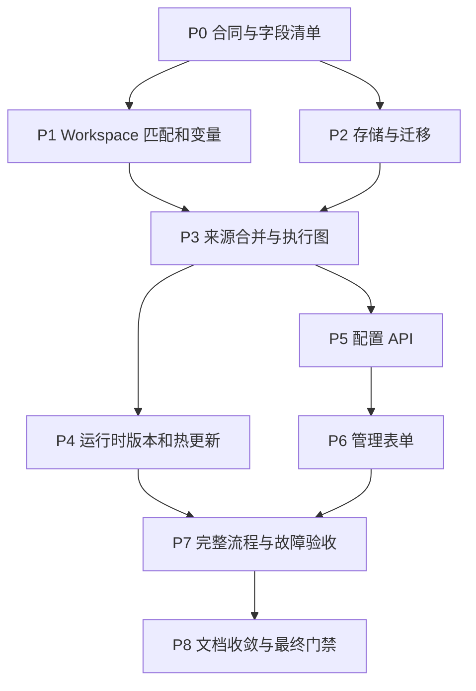

# Workspace 与动态配置执行计划

状态：仅规划，未开始实施。设计合同见
[详细设计](../specs/2026-09-11-workspace-config-management.md)，测试 ID 和后端证据要求见
[测试计划](2026-09-11-workspace-config-tests.md)。任何复选框只有实现、对应测试和适用最终门禁通过后才能勾选。

## 1. 执行约束与依赖

源码基线为 `e609cd7`。开始实现时重新检查 `git status`、schema、bootstrap、调用方和相关测试，保留已有工作区修改。当前只写文档和 example 注释，不安装依赖、不修改业务代码、不运行迁移或真实服务。

默认设计：文件显式配置优先并锁定；数据库提供补充来源；发布后新接收任务生效，已接收任务固定版本；新规则使用隔离目录布局，旧绑定保留兼容布局。改变其中任一合同必须同步设计、测试矩阵及示例，不能靠实现中的 fallback 决定。

P1/P2 在合同确定后可独立推进；P4/P5 共享发布和 snapshot 合同，不能各自定义 revision。此图描述代码依赖，不要求本轮或后续自动启动并行 agent。

## 2. 阶段清单

### P0. 配置合同与兼容输入

- [ ] 从 `packages/core/src/config.ts` 导出可复用组件 schema，保持 Zod 3、现有默认值和已废弃字段拒绝行为。
- [ ] 建立永久字段清单：path、kind、default、source ownership、inheritance、capability、resolver、consumer、UI control、test ID。逐项覆盖 provider、model groups/overrides、trigger、channel、route、agent/search/sandbox、review、workspace。
- [ ] 确认 `triggers`/outputs/providers 的 passthrough 字段实际消费者，将可管理字段结构化；未知旧扩展字段保留而不宣称动态可编辑。
- [ ] 建立 raw config source 文档和文件位置模型，将读取原文、旧版本转换、填默认值和最终 schema parse 分开。
- [ ] 为现版 `source_repo`、`repos[].match`、outputs route 顺序、空数组和默认 workspace 行为保存独立兼容 fixtures。
- [ ] 固定未来配置 `formatVersion`、revision API、错误码、matcher/helper 语言和实例 identity 合同，形成纯类型和验证函数。
- [ ] 清点 `review` 中 schema-only 与实际接线字段；将本次必须支持的全局 Review 字段分配到 P4，不留下“表单可保存但运行无效”。

影响：`packages/core/src/config.ts`、`review-event.ts`，拟新增 `config-source.ts`、`config-format.ts`、`config-components.ts`；相应 `packages/core/test/`。不新建 pnpm package。

退出条件：F01–F12、C01–C08、B01–B05 通过；现有 config/exclusion/model-chain 测试保持通过；新字段仍未接入运行时的部分明确标记。

### P1. Workspace 匹配、来源变量和目录

- [ ] 将现有 RE2/glob 编译抽成最小共享函数，保留 `auto-commit-exclusion` 行为；新增 exact matcher、字段目录和大小限制。
- [ ] 新增 `workspaces.instances.*.match/work_path`，校验与 `source_repo` 互斥、trigger 引用、非法变量和歧义。
- [ ] 增加 `SourceDescriptor` 及 provider descriptor registry；GitHub/GitLab/Gitea/Forgejo/P4/SVN/manual/scheduled 各字段含可用事件、获取阶段和可空性。
- [ ] 将 webhook 翻译拆成已鉴权来源描述与 workspace 解析；所有同类 trigger profile 均从 registry 选择，覆盖目前只有首项配置路径的来源。
- [ ] P4/SVN 需要额外 metadata 的匹配采用最小持久待解析 receipt；后台验证后再生成现有自动提交 receipt，转交具备幂等关系，接收失败返回 503。
- [ ] 新增隔离 Handlebars 实例和 AST 白名单，支持 `segment/default/hash/lower`，发布时编译；变量 null/default 和路径非法值返回稳定错误码。
- [ ] 新增 `WorkspaceBinding`、`WorkspaceLayout` 和 instance identity，所有目录消费者使用显式布局，取消新布局对 source 目录名称的推断。
- [ ] 修改 VCS factory 使用解析后 repo/scope，覆盖 P4 streams 非首项和 SVN 多项目；可写 checkout、agent HOME/XDG、MCP state、context repo 分 run 隔离。
- [ ] 保留旧目录、模板、operator prompts/skills 的只读回退；实例 hash 不影响旧 stream/member/delivery identity。

影响：`packages/core/src/auto-commit-exclusion.ts`、`review-event.ts`；`packages/server/src/webhook-common.ts`、各 `*-webhook.ts`、`bootstrap.ts`、`review-orchestrator.ts`、`run-snapshot.ts`；`packages/vcs/src/{git,p4,svn,context-repos}.ts`；sandbox materialize 合同；拟新增 core matcher/template/layout 和 server source descriptor 模块。

依赖变更：`@aicr/core` 直接声明与现有相同版本范围的 Handlebars，避免 core 反向依赖 outputs；不新增另一套模板/匹配依赖。若目录职责最终位于 server，则依赖放在实际消费者所属 package，仍保持单向依赖。

退出条件：W01–W15、V01–V14、L01–L14 通过；Windows/Linux 路径样例一致；两工程同模板结果没有共享可写目录或 memory。

### P2. 存储与迁移

- [ ] 引入 backend-neutral `ConfigStore` 异步合同：readHead、readRevision、commitChangeset、readOperation、readAudit、read/write snapshot、binding、session 和 close。
- [ ] SQLite 在现有 `_migrations` 后追加配置相关表，保留 001–006 的定义与 checksum baseline，读取账本移入锁内。
- [ ] 新增 `MigrationRunner` 和 namespace ledger，分别协调 store/config、auto-commit、app-owned queue payload、catalog cache；避免两个 runner 同时写同一 namespace。
- [ ] SQLite DDL/data/version 使用 immediate transaction；busy/timeout、中断、重复启动有界恢复。
- [ ] 添加 PostgreSQL `pg` 驱动和 Drizzle 方言；将 `StoreDb` 外部消费者收敛为最小异步 service 合同，实现 stats/retention/reflection/catalog/recording，消除非 SQLite 启动拒绝。
- [ ] 实现 PostgreSQL migration advisory lock、同 client transaction、SQL/JSON/time/integer 映射和 close；不为 queue 新增 postgres kind。
- [ ] 实现 Redis config backend：独立 hash-tag namespace、不可变 generation、manifest、CAS head、审计材料、operation 去重和 fencing。
- [ ] Redis migration 采用分阶段 generation 和 checkpoint；旧 key schema 不被脚本失败污染；不读写 BullMQ 私有格式，不使用 FLUSHDB/全库 KEYS。
- [ ] 实现配置 JSON format converters 与历史 alias/array 迁移，冲突时失败，原文件只读。
- [ ] 旧 receipt/job 新增 snapshot 关联迁移，建立跨存储 snapshot 先写、receipt 后写的恢复和无引用 snapshot 保留策略。
- [ ] 管理 session 单独存储 hash/TTL，保持 Bearer 协议，多进程登出一致；session 不进入配置审计原文。
- [ ] CLI 添加 `migrate --status/--check/--apply` 和 auto/verify 启动流程；schema 更高、checksum 改变、版本缺口均阻止 admission/worker。

影响：`packages/store/src/{database,schema,stats,reflection,model-catalog,index}.ts`；server observability/bootstrap/catalog；`packages/core/src/sqlite-auto-commit-store.ts`、`redis-auto-commit-store.ts`、队列 payload；`packages/cli/src/app.ts`。新 driver/types 与 package manifest 同步，不把新 adapter 藏成只可 mock 的接口。

退出条件：S01–S13、M01–M20、A01–A08 的对应后端合同通过；SQLite/PostgreSQL/Redis 均有真实服务/文件升级与重开证据。PostgreSQL stats/recording 未接线时本阶段不得完成。

### P3. 来源合并、路由和发布服务

- [ ] 实现 raw file + DB + defaults 合并和每字段 provenance；文件实体锁、全局叶字段锁、shadowed 数据库记录可见、显式空数组/false/0 合同一致。
- [ ] 实现 changeset 的实体创建/修改/停用/删除/rename，引用修改与实体变更一次提交；不能接受失效 provider/model/channel/workspace/trigger 引用。
- [ ] 实现内部配置 graph compiler，统一 workspace 选择、分析参数、输出选择；旧路由由 compatibility compiler 转换，禁止混用两套路由控制同 trigger。
- [ ] 实现候选 prepare → revision CAS → audit/snapshot → 本机 generation install，operationId 幂等、响应丢失查询、已提交未激活状态。
- [ ] revision restore 重新应用当前文件锁、capabilities 和 secret reference 约束，创建更高 revision；不执行数据库 downgrade。
- [ ] 固定 preview 无副作用边界，构建来源样例、匹配解释、变量完整路径与模型/输出有效值视图。
- [ ] 为 config_sources 关闭、来源不可达、namespace/file digest 不一致制定 readiness 和诊断状态。

影响：core config-source/components/validation；server 拟新增 `config-service.ts`、`config-compiler.ts`、`routing.ts`。旧输出 renderer 和 no-problems 合同不重新定义。

退出条件：C01–C15、R01–R13、S01–S13 通过；一次 changeset 更新关联实体全成功或全失败，发布失败不改变 head。

### P4. 运行时热更新与持久任务

- [ ] 从 bootstrap 提取 RuntimeConfigManager，用 generation 管理 registry/factories，queue/store/budget/lease 与 generation 分离。
- [ ] Hono 固定 dispatcher 每次 admission 获取当前 head 和对应 registry；新增/删除 trigger 立即作用于新请求，不动态重复挂载路由。
- [ ] 为 run/job/receipt/batch/metadata 重试持久化 execution snapshot，引入 snapshot pin/refcount 和 generation 资源释放。
- [ ] auto-commit 在 snapshot/policy 边界组批，但不改变 delivery/member 去重；连续通知、重启、旧/新版本交错不得丢成员或重复发布。
- [ ] 每个任务的 VCS、model/main/triage/summary、agent fallback/repair、MCP、publisher、reflection、输出语言读取同一个 execution plan。
- [ ] workspace 级 agent、sandbox、search、review 实际接线；补足 review include/exclude/max/labels/reflection/fetch_extra 等字段的 consumer，不依赖只读 schema 默认值。
- [ ] 已明确请求的容器 sandbox preflight 不可用时拒绝该候选，UI 显示原因；不静默切 native。保留文件声明的信任上限。
- [ ] catalog overrides 更新后建立新模型解析缓存；不得提前关闭新 generation 仍需使用的 Redis catalog 连接；旧 generation 按引用释放。
- [ ] rate/concurrency 在 claim 边界更新，保留计数与预算；降低限制不杀运行任务。
- [ ] 多副本每次 admission 读取 durable head，后台 notify/poll 仅加速；fileDigest 不一致或新版本 prepare 失败的副本停止新 admission。
- [ ] 修改 project soft-delete 判定，动态绑定按 definition/binding 状态管理，不误删通配规则下的活跃工程。
- [ ] CLI review/dry-run/eval/serve 中使用配置的入口共用加载和解析；保留显式 `--source-root` 行为和 dry-run 无发布合同。

影响：`bootstrap.ts`、`index.ts`、`review-orchestrator.ts`、`auto-commit-runtime.ts`、`auto-commit-scheduler.ts`、`model-catalog-service.ts`、`run-snapshot.ts`、CLI app、queue/worker 及 store recording。

退出条件：H01–H18、R01–R13、B01–B10 通过；每类配置用下一次真实编排调用证明更新，不能只断言 AppConfig 对象变化。

### P5. 配置 API

- [ ] 将登录/auth/session 与统计 API 的 store 耦合分开，挂载 `/api/admin/config`，配置管理不依赖是否启用统计。
- [ ] 实现设计列出的 read/schema/validate/preview/changesets/operations/revisions/restore/status 端点，严格 DTO 与分页/大小限制。
- [ ] 复用管理员鉴权，普通 workspace/webhook token 无写权；文件锁和 capability checks 在服务端执行。
- [ ] 添加 secret-reference allowlist/用途限制，API、日志、审计、导出及错误统一脱敏，不返回或保存环境变量值。
- [ ] 返回字段级错误和 revision conflict，处理重复提交、浏览器超时后查询 operation、已提交未激活状态。
- [ ] 更新 OpenAPI/路由文档和合同 fixtures；保持 path_prefix、禁用管理页、过期/登出行为。

影响：`admin-auth.ts`、`observability-api.ts`、`index.ts`；拟新增 `config-api.ts`、DTO 和 validation 模块。

退出条件：A01–A15、C/R 相关 API 合同通过；绕过 UI 直接改文件项仍被拒绝；无明文 secret 泄漏。

### P6. 通用表单与管理页面

- [ ] 实现有限 ConfigUiSpec、组件 registry 和五类纯映射函数，枚举/默认值引用 schema 定义，不遍历 Zod 私有结构。
- [ ] 覆盖 text/number/toggle/select/multiselect/ordered-list/map/secret-ref/matcher/path-template、继承态、只读态、variant 切换、未知扩展无损保留。
- [ ] 将配置 renderer 与 API client 从内联 HTML 中分离为可测试模块，扩展现有 server build 复制/编译资产，不默认新增 UI workspace/React。
- [ ] 增加 providers、模型组/覆盖、triggers、channels、routing、agent/search/sandbox、review、workspace、版本历史入口，控件与能力矩阵一致。
- [ ] route/workspace preview、模型组排序、周计划采用专用控件；保存显示实际 revision，冲突保留草稿并提供差异比较。
- [ ] 文件来源显示只读详情与“复制为新数据库配置”；field provenance、引用影响、停用/删除和历史恢复可操作。
- [ ] 响应式表格、键盘焦点、标签/错误关联、禁用状态和窄屏布局；工具用图标与 tooltip，避免依赖纯拖拽。
- [ ] 新浏览器测试如需 Playwright，作为明确 dev dependency 加入正式 gate；不把生产数据库或外部 LLM 作为页面测试前置。

影响：`packages/server/src/dashboard/`、server package build、server tests；必要 root browser-test/dev dependency/CI wiring 必须单独审查，不弱化现有测试收集。

退出条件：U01–U24 所有参数化用例通过，范式模块 100% 四项覆盖率；桌面/窄屏浏览器管理 CRUD、继承、冲突、只读、立即生效流程通过。

### P7. 完整流程与故障注入

- [ ] SQLite/Redis/PostgreSQL 配置后端逐一从真实旧数据升级，重开连接并跑一条 review 路径，断言数据保留和新 revision 消费。
- [ ] 两工程同规则、同 repo 名不同 owner/host、GitLab subgroup、P4 多 stream、SVN 多 project，验证正确路径/凭据/输出归属。
- [ ] 两副本读同配置源，保存后向另一副本发事件；模拟 notify 丢失、prepare 失败、DB 断连、fileDigest 不一致。
- [ ] 审查运行中更新 provider/route/agent，验证旧任务继续旧版，下一任务全链用新版；旧 receipt 与新版交错组批。
- [ ] migration 锁过期/崩溃/双初始化/partial generation/未知高版本/旧 writer 交错，验证无半升级状态和可恢复诊断。
- [ ] 管理流程 UI → API → DB → Runtime → 输出 spy 有完整数据断言；至少一条 fixture 使用本地真实 VCS，付费 LLM 使用可控测试实现。
- [ ] 生产 Git 服务凭据、部署 ACL/TLS、真实模型调用和目标版本兼容单独验收；没有环境条件则记录为未验收，不宣称全后端完成。

退出条件：E01–E10 通过，各后端/平台清晰记录实测、模拟或未运行；没有用 skip/零测试数代替通过。

### P8. 文档、AI 资产与最终门禁

- [ ] `example/config.yaml` 将本轮 planned 注释转为 schema 可执行配置，变量/helper 目录生成校验；`example/README.md` 增加 UI 管理、路由预览、升级命令和冲突优先级。
- [ ] 更新 `docs/site/src/content/docs/{en,zh-cn}/configuration/{overview,llm,agent,outputs,storage,queue}.md`、`start/dashboard.md`、`reference/{config-fields,template-variables,cli}.md`、`integrations/{vcs-providers,agent-adapters,output-channels}.md` 和部署运维页，两种语言同次同步。
- [ ] 更新 `docs/ai/architecture.md` 的 workspace、运行时、配置、存储合同，决策写入 `docs/ai/decisions.md`；源码链接和字段目录保持真实。
- [ ] 更新 `.agents/skills/agent-runtime-integration/`、`output-channel-contracts/`、`plan-implementation-audit/` 中实际受影响的运行时/路由/版本验证规则；如出现已修复可复发错误，通过 `AGENTS.known-pitfalls.md` 导航写入对应专题，不复制整份设计到根提示词。
- [ ] 审查 `prompts/system/code-reviewer.system.md` 是否仍写死旧 source/agent 布局；只在需要改变实际 agent 运行指导时更新，不把数据库管理操作灌入 review prompt。
- [ ] Linux 执行 `pnpm ci`；Windows 按 AGENTS.md 顺序执行 lint、typecheck、完整 coverage、markdownlint、build、eval validate。docs/site 改动另跑 docs:check/docs:build；新增 browser/真实后端 suite 纳入对应最终 gate。
- [ ] 对最终 diff 做 `git diff --check`、链接/示例字段/双语一致性检查，记录实际发现的测试文件数、通过/失败/跳过数与 backend 版本。
- [ ] 全部验收完成后将交付证据写入里程碑，删除本组已完成 specs/plans，从 Plan.md 去掉完成项；未完成或缺真实后端证据时继续保留。

## 3. 风险与拆分判断

| 风险 | 实施要求 | 验收证据 |
| --- | --- | --- |
| PostgreSQL 影响同步 StoreDb 消费者 | P2 先封装 store service，再接 pg；不把 `Promise` 强转为现有类型 | 两种 SQL backend 的 stats/reflection/catalog/retention/recording 同合同 |
| 配置版本与自动组批耦合 | P3/P4 一起定义 snapshot 边界和旧 receipt 绑定 | H08–H12，不跨版本合并、不重置 delivery 去重 |
| 多来源路径恶意值与目录共享 | AST 白名单、路径段编码、完整身份后缀、显式 layout | V/L 系列，实际 symlink/junction 与同名仓库 |
| UI 范式越做越像第二个 schema 系统 | 元数据只描述控件，服务端 Zod 唯一校验真源 | U 系列及每个 field 的 schema/consumer/UI/test 对照 |
| 保存成功但旧闭包仍在使用 | RuntimeConfigManager、版本 head 屏障、各调用路径固定 snapshot | H 系列必须断言生成 bundle/调用参数/输出目标 |
| 旧版本无法理解新协议 | 首次迁移安排 drain；之后按 reader/writer 范围验收滚动升级 | M17–M20 双版本进程测试 |

预计工作规模以阶段交付评估，不在未实现和未取得真实 PostgreSQL/P4 环境证据前承诺工期。阶段可以拆 PR，但完整需求只有 P0–P8 均满足退出条件后才完成。
