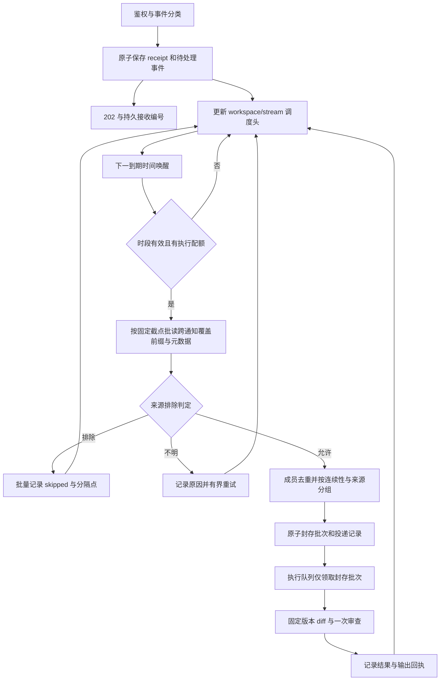

# 自动提交分析：延迟、执行时段与连续提交合并

状态：设计草案，尚未实现。调研日期：2026-09-08；修订日期：2026-09-09。

本轮只交付文档。文中的新增字段、接口、数据结构和默认行为均为拟议合同，
不能视为当前版本已支持的配置。执行顺序见[实施计划](../plans/2026-09-08-auto-commit-scheduling-plan.md)，
验收条件见[测试矩阵](../plans/2026-09-08-auto-commit-scheduling-tests.md)。

## 1. 目标与范围

自动提交事件先进入所选队列后端，默认等待 120 秒，在允许执行的时段内，
按 VCS 顺序把提交来源分组键相同的连续提交合并为一个审查批次。P4 分组至少包含
User + Client，用于区分同一提交方在不同任务工作区中的提交。调度器批量读取有界候选，
按下一到期时间唤醒；不持续逐条扫描等待队列，也不为每条提交创建定时器。
执行时段支持多组周计划，每组独立设置星期集合和多个时间段，例如工作日避开下午高峰、
周末全天可用。全局和 workspace 均使用同一规则形状。
自动分析支持按提交来源字段排除机器人/CI 提交，规则可使用通配符或正则。
通知只表示接收及覆盖范围，不是执行批次边界；同一流内跨多个通知的到期连续成员必须
一起参与分组。来源相同且未触及拆分条件时，不能仅因来自不同 webhook 而重复分析。

覆盖 GitHub、GitLab、Gitea/Forgejo 的分支 push，P4 `change-commit` 和 SVN
`post-commit`。Git 服务共用 Git 提交语义。原生 Git adapter 也提供相同的历史能力；
本次不另造裸 Git webhook 协议或周期性全仓抓取任务。

PR/MR、评论命令、issue triage、手工 review/replay 和既有 scheduled 入口不自动套用
这套提交延迟、时段、来源排除和来源分组规则。事件分类使用 provider、事件来源和 targetKind，
不能只判断是否存在 `headSha`。自动提交的队列重试/重新排队仍受执行时段限制；
它与用户显式发起、创建独立请求的手工 replay 分开分类。

以下采用推荐设计值，尚未经过实现与负载验收：

- 延迟从每条事件首次成功入队起算，后续提交不重置旧提交的等待时间。
- `queue.workers.concurrency` 未配置时，自动提交消费者默认全局并发 1；显式配置可放宽。
- 每个 AICR workspace 同时最多执行一个自动提交批次，防止共用 `source/agent` 目录互相覆盖。
- 时间段限制新批次的启动，已启动批次可完成；不在截止时间强杀 agent。
- 同一作用域内按顺序审查净变更；批次内已经被后续提交修复的问题不重复报告。

## 2. 当前实现证据

以下是源代码核验结果，不是对现有文档的转述。链接定位到文件，符号用于后续复核。

| 表面 | 当前代码与发现 | 对方案的影响 |
| --- | --- | --- |
| 自动入口 | [`server/index.ts`](../../../packages/server/src/index.ts) 的 `scheduleTriggerProcessing` 用 `setTimeout(..., 0)` 启动，重试也是内存 timer | 必须把自动提交入口真正接入持久队列；只改 queue 无法改变生产执行流程 |
| 服务接线 | [`bootstrap.ts`](../../../packages/server/src/bootstrap.ts) 仅在传入 `jobHandler` 时创建 worker；[`cli/app.ts`](../../../packages/cli/src/app.ts) 的 serve 没有传入 handler；未发现生产 `worker.start()` 接线 | 实施包含 handler、启动、恢复和停止，不以“创建了 queue 对象”作为完成证据 |
| 现有去重 | [`review-deduplicator.ts`](../../../packages/server/src/review-deduplicator.ts) 按 target 保存一个最新 pending 请求 | 自动提交不能沿用覆盖式 pending，否则可能丢失中间提交；PR/MR 路径保留 |
| 公共队列 | [`queue.ts`](../../../packages/core/src/queue.ts) 无公开首次延迟参数；memory 内部的 `availableAt` 仅用于失败退避 | 公开绝对到期时间，首次延迟与重试分别建模 |
| SQLite queue | [`sqlite-queue.ts`](../../../packages/core/src/sqlite-queue.ts) 有 `available_at` 和原子单条 claim，按 `seq` 取队；以 `started_at` 回收超时任务 | 可复用本地数据库，但需增加可索引的调度头、批次原子写入、续租和所有权校验 |
| Redis queue | [`redis-queue.ts`](../../../packages/core/src/redis-queue.ts) 使用 BullMQ 手动 `getNextJob(block:false)`；排除的 workspace 被放回队首；未见手动续锁 | 延迟可用 BullMQ 公开 API；调度头不能因一个忙 workspace 阻塞其他 workspace，长任务必须续锁 |
| worker | [`queue-worker.ts`](../../../packages/core/src/queue-worker.ts) 默认每秒轮询，workspace 活跃计数只在进程内；`lockTtlSeconds` 未被消费 | 增加到期唤醒、跨进程配额与租约，不能宣称当前已经全局串行 |
| Git 元数据 | [`webhook-common.ts`](../../../packages/server/src/webhook-common.ts) 的 push author 来自 pusher；[`gitlab-webhook.ts`](../../../packages/server/src/gitlab-webhook.ts) 来自推送用户 | pusher/操作者不能替代 Git commit author |
| 事件作者合同 | [`review-event.ts`](../../../packages/core/src/review-event.ts) 的 `ReviewActor` 显式 schema 字段为可选 username/email/displayName，没有定义作者来源或核验状态；P4 enrich 在 user/client 均存在时直接返回 | 事件 author 不能直接作为组批身份；后台须读取 VCS，并分开保存事件操作者与记录作者 |
| 现有过滤 | [`config.ts`](../../../packages/core/src/config.ts) 的 review.include/exclude、trigger.include_cr_file/exclude_cr_file 面向文件；[`path-filters.ts`](../../../packages/vcs/src/path-filters.ts) 会归一化路径并尝试 basename 匹配，[测试](../../../packages/vcs/test/path-filters.test.ts) 固定了此行为 | 新增独立提交来源规则，不能把用户名/Client 交给文件路径 matcher；当前没有已接线的来源排除合同 |
| VCS 接口 | [`contracts.ts`](../../../packages/vcs/src/contracts.ts) 的 `listChanges` 返回文件范围，没有有序提交列表或作者完整性证明 | 新增有界历史读取合同，不复用 blame 接口猜作者 |
| P4 元数据与 diff | [`p4-webhook.ts`](../../../packages/server/src/p4-webhook.ts) 已有 `submitterWorkspace`，缺失时逐请求 `describe -s`；[`p4.ts`](../../../packages/vcs/src/p4.ts) 的 `diff` 只执行 head changelist 的 `describe -du` | 提交 client 可复用，但查询应移到批量准备阶段；合并后必须新增真正的范围 diff |
| Git/SVN diff | [`git.ts`](../../../packages/vcs/src/git.ts) 已支持端点 diff；[`svn.ts`](../../../packages/vcs/src/svn.ts) 支持 `-r base:head` 或单 revision 变更 | 可复用端点读取，仍须先证明成员连续、范围完整 |
| 配置 | [`config.ts`](../../../packages/core/src/config.ts) 的 workspace 不支持 queue 块；`review.commit_strategy` 有 schema/默认值，搜索未见运行时消费者 | 新策略放进可分层的 review 命名空间；不能把旧 enum 当作已有合并实现 |
| 测试 | [`redis-queue.test.ts`](../../../packages/core/test/redis-queue.test.ts) 以 fake BullMQ 验证基础状态；SQLite 有真实文件重开测试 | mock 不能证明 Redis 的 delayed、Lua、续锁、故障恢复与公平性 |

`queue.kind` 的当前实现是 memory、SQLite、Redis。RabbitMQ 只有配置值，factory 会告警并
回退 memory。`storage.database` 的 PostgreSQL 也是预留值，bootstrap 内置 store 只接受
SQLite。`storage.cache` 和 `storage.object` 不具有任务 claim 合同。
因此“所有存储层适配”在本方案中指三个已实现队列后端拥有一致功能，且不依赖选用哪种
观测、缓存或 artifact 存储；不把 PostgreSQL、RabbitMQ、S3 描述为已实现任务队列。

## 3. 配置合同

新增 `review.auto_commit`，在三个位置具有相同的字段形状：

1. 全局 `review.auto_commit`。
2. `workspaces.defaults.review.auto_commit`。
3. `workspaces.instances.<id>.review.auto_commit`。

解析优先级为 instance → defaults → global → 内置默认。仅在完成分层解析后填充默认值，
避免某层只设置 schedule，却被该层的默认 delay 覆盖上层配置。

| 相对字段 | 类型/拟议默认值 | 语义 |
| --- | --- | --- |
| `delay_seconds` | 非负整数，默认 `120` | 首次接收后的最短等待；`0` 取消这项等待，仍受时段约束；拒绝非有限值和会溢出时间戳的值 |
| `schedule` | 可选完整对象 | 缺省继承上层；任何一层显式设置时整体替换，避免旧规则组与新时区意外组合 |
| `schedule.timezone` | IANA 时区字符串；显式 schedule 缺省为 `UTC` | 不读取宿主机本地时区；无效时区在启动时拒绝 |
| `schedule.rules` | 规则组数组；显式 schedule 中必填 | 每周重复；`[]` 显式表示全周全天可启动，可清除上层限制；不能只填 timezone 就意外解除限制 |
| `schedule.rules[].days` | 非空星期数组，必填 | 枚举 `mon/tue/wed/thu/fri/sat/sun` 对应周一至周日，重复项去重；按配置时区的本地日历判断 |
| `schedule.rules[].windows` | 非空 `{ start: string, end: string }[]`，必填 | 本组所选星期的有效时间段；所选日全天用 `00:00–24:00`，组内空数组拒绝 |
| `exclude_sources` | 来源排除规则数组，内置默认 `[]` | 缺省继承上层，显式数组整体替换，`[]` 清除上层排除；独立于 schedule/delay 解析，详细字段见 §5.3 |

`start` 使用严格 `HH:mm`，范围为 `00:00`–`23:59`；`end` 额外允许 `24:00`，表示
该日结束的次日零点。`24:00` 只在配置解析器中转换成次日边界，不直接传给只接受
0–23 小时的日期 API；`24:01` 等值拒绝。区间为左闭右开 `[start,end)`；
`start == end` 拒绝，单日全天明确写为 `00:00–24:00`。

多组规则取并集，命中任意一组即允许启动，规则顺序不决定优先级。重叠、相接和重复
区间在加载时归一化，不因此创建多个任务。存在规则时，未被任何区间覆盖的时间禁止
启动；`rules: []` 才表示解除全周限制。每组只描述可用日历，首次延迟仍由
`delay_seconds` 的全局/workspace 分层值决定，不引入同一时刻多个不同 delay 的冲突。

`end < start` 表示延续至次日，并按开始日归属。例如 `days: [fri]`、`23:00–07:00`
覆盖周五 23 点至周六 7 点，即便 days 没有 sat；`days: [sun]` 的同一时段延续至下周一。
如果想让每天的凌晨段严格归属当日，像下面的工作日示例一样拆成 `18:00–24:00` 和
`00:00–13:00`。未命中的星期可能接收上一日跨午夜区间的延续，不能提前截断。
首版支持周计划，不增加节假日、日期例外或 cron 表达式。

全局配置是默认值，workspace 是覆盖值，不求交集。对所有 workspace 施加强制运营禁用
日历属于另一种合同，本次不增加隐含限制。

下面的全局规则对应“周一至周五 18:00–24:00 和 00:00–13:00 可用，周六、周日全天可用”。
后面的 workspace 示例演示独立覆盖。拟议 YAML 仅用于评审，当前版本不可使用：

```yaml
review:
  auto_commit:
    delay_seconds: 120
    schedule:
      timezone: Asia/Shanghai
      rules:
        - days: [mon, tue, wed, thu, fri]
          windows:
            - start: "18:00"
              end: "24:00"
            - start: "00:00"
              end: "13:00"
        - days: [sat, sun]
          windows:
            - start: "00:00"
              end: "24:00"

queue:
  workers:
    concurrency: 1
    per_workspace_concurrency: 1

workspaces:
  defaults:
    review:
      auto_commit:
        delay_seconds: 180
  instances:
    game:
      # 其余 source_repo 等现有必需字段省略。
      review:
        auto_commit:
          delay_seconds: 120
          schedule:
            timezone: Asia/Shanghai
            rules:
              - days: [mon, tue, wed, thu, fri]
                windows:
                  - start: "23:00"
                    end: "07:00"
    tools:
      review:
        auto_commit:
          delay_seconds: 0
          schedule:
            timezone: UTC
            rules: []
```

上例全局规则在 Asia/Shanghai 的预期如下；表中的可用仍须满足首次延迟和执行配额。

| 本地时刻 | 是否可启动 | 原因 |
| --- | --- | --- |
| 周一至周五 00:00–13:00 | 是 | 工作日凌晨/上午段 |
| 周一至周五 13:00–18:00 | 否 | 工作日下午高峰段，13:00 已关闭 |
| 周一至周五 18:00–次日 00:00 | 是 | 工作日晚间段，18:00 已开放 |
| 周六、周日 00:00–次日 00:00 | 是 | 周末全天段 |

这些规则连成的周末长区间是周五 18:00 至下周一 13:00；在周六、周日及周一零点
无需关闭再打开，也不能重复唤醒/执行同一批次。

本次不赋予旧 `review.commit_strategy` 的 `per_commit/head_only/aggregate` 新含义，
也不据此丢弃提交。它目前没有消费者，实施时须在配置参考中说明这一事实。
来源分组键与连续性是新自动批次的固定规则，暂不增加第二套合并模式开关。

## 4. 延迟与执行时段

所有持久时间使用 UTC epoch milliseconds。对成员 `c`：

```text
eligibleAt(c) = firstAcceptedAt(c) + resolvedDelaySeconds(c) * 1000
earliestStart = nextAllowedInstant(max(eligibleAt, retryNotBefore), policy)
```

`firstAcceptedAt` 是队列成功接收的服务器时间，不采用可回填、可伪造的 commit 日期。
同一 Git push 中展开的提交继承该事件首次接收时间；重叠推送中重复出现的提交使用
最早覆盖通知的接收时间和已解析 delay。“最早”以持久接收顺序判定，时钟回拨或后台
先展开哪条通知不能改变这一结果。
重复投递不重置延迟，也不产生第二个逻辑成员。

组批时，每个纳入成员均须已满足自己的 `eligibleAt`。A 于 10:00 入队，B 于 10:01 入队，
即使来源分组键相同，10:02 也只能启动 A；若 worker 到 10:03 才空闲，可以合并 A+B。
这避免为了等“最后一次提交”无限延后旧任务。低谷窗口之前积累的到期成员可批量合并。

`nextAllowedInstant` 返回不早于输入的最早允许时刻；窗口已经关闭时直接计算下一个
边界。不能每秒重新扫描整个队列，也不能先占用 worker 再 sleep 到窗口开始。

加载配置时，把各组 days/windows 展开成从周一零点起算的本地周内分钟区间，拆分
跨周区间并合并并集；内部范围为 `[0,10080)`。它只是本地日历索引，不能当作固定
604800 秒的 UTC 周期。每份有效策略只编译一次，workspace head 复用编译结果；
不会为每个规则组建立队列、worker、数据库轮询或单独 timer。
运行时查找当前或下一个有效的星期/时间边界，再结合本地日期和时区转换成 UTC。
跨周推进按日历日期运算，不给上周的 UTC 时间直接加七天；DST/日期跳过导致某次
窗口不存在时继续找下一次实际窗口，不把本周没有可用时刻误判成永久禁用。

时区处理采用明确的本地时钟成员判断：DST 重复小时中的两个实际时刻，若其本地时间
落在窗口内，都允许启动；不存在的本地时间没有可执行时刻。整个窗口被跳过时顺延到
下一个实际存在的窗口。边界候选需结合时区 offset transition 计算并重新验证成员关系，
不能无条件把不存在的 02:30 平移成窗口之外的 03:30。时区转换方案须兼容项目 Node
下限；优先验证维护中的时区库/Temporal polyfill，不假定所有 Node 22 环境已有原生 Temporal。
关于重复和缺失时刻的依据见 [TC39 时间区说明](https://github.com/tc39/proposal-temporal/blob/main/docs/timezone.md)。
日历天/周运算与固定时长的区别见 [TC39 ZonedDateTime](https://github.com/tc39/proposal-temporal/blob/main/docs/zoneddatetime.md)。

claim 时和真正开始 VCS 准备前都检查时间。窗口关闭期间仅接收事件、写入和维护租约；
不批量 clone、读 diff 或调用 LLM。已启动批次允许越过窗口结束；该批次失败后的新 attempt
是新的启动，重新应用窗口。服务停机错过窗口后，下次启动计算当前或下一窗口，不补发
过期的定时启动次数。

首次延迟作为入队事实保留。执行 schedule 使用当前有效配置；重启加载新配置时，按
workspace 分页重算调度头，未完成重算的头先禁止启动。首版不增加热重载协议。
若多个进程共享后端，使用同一配置版本；不一致的 consumer 拒绝领取，避免一个允许、
一个禁止的矛盾。时钟跳变后重新验证 UTC 到期时间；timer 只作为唤醒提示。

## 5. 提交来源、合并分组与排除

### 5.1 提交来源分组键

本功能统一使用“提交来源”描述提交方及任务上下文，用“提交来源分组键”描述合并
判据。“作者”只用于 VCS 作者事实，“事件操作者”只用于有明确证据的推送/触发操作人。
同一人的不同 Client 可以对应不同任务，因此不能把“作者相同”直接等同于“可以合并”。
分组键相同也不证明自然人身份或语义上属于同一需求，不由 LLM 猜测任务相似度。

先按如下字段构造 canonical stream key，再检查相邻提交的来源分组键：

```text
workspaceId + triggerName + VCS 类型 + 来源命名空间 + 源范围/分支 + 历史世代
```

不同 workspace、trigger、仓库、Git 完整 ref、P4 depot/stream/view 范围、SVN 监控根之间
不合并。历史重写或路径复制改变来源时建立新世代。key 使用有版本的结构化序列化和
哈希，不能用简单字符串拼接造成分隔符碰撞。凭据不进入 key。

来源命名空间复用配置中已确定的 VCS 来源：Git/SVN 包含规范仓库地址，P4 包含规范服务
地址，不能只使用 `//depot/...`。用户名只在该来源内比较，不建立跨服务器的全局人员库。
不自动归并不同地址的镜像或别名；来源变更建立新世代，凭据轮换不改变来源身份。

| VCS | 来源 key 的最低字段（均带来源命名空间） | 不参与替代的字段 |
| --- | --- | --- |
| Git（所有 Git 服务） | 原始 commit author 的 `name` + `email`，两者同时相等 | committer、pusher、sender、平台账号和 PR 作者不参与；`.mailmap` 不自动改写 key |
| P4 | 已提交 changelist 记录的 `User` + `Client`，两者同时相等 | ImportedBy、trigger 操作者、分析账户、AICR workspaceId 和分析 client 都不能代替 User/Client |
| SVN | 固定 revision 的 `svn:author` 原值，即 `svn log --xml` 的 author | 访问 SVN 的服务账户、本机账户、展示名和其他仓库的同名账户不参与 |

P4 必须按 User + Client 判断：同 User 换 Client、同 Client 换 User 都分批；Client
是任务上下文的一部分。缺 User 或 Client 时来源 key 不完整，不合并；保留已知字段，
不能降级成 User-only，也不能用分析 client 补齐。depot/stream/view 等范围仍受 stream
key 约束，不同 AICR workspace 也不合并。Client 内切换任务但历史没有可识别分界时，
不能声称已识别业务任务；首版以相邻历史、待处理成员和有界批次作为合并边界。

P4 官方将 `User` 定义为 change owner，并单列 `Client` 和 `ImportedBy`；管理员还可
修改已提交 change 的 User。这些字段区分作者归属和任务上下文；本方案将二者共同
作为 P4 合并最低条件，不能称为不可变的自然人身份。
依据见 [p4 change](https://help.perforce.com/helix-core/server-apps/cmdref/current/Content/CmdRef/p4_change.html)。

Git 保留 name+email 的保守默认：官方 `.mailmap` 示例包含不同作者共用邮箱的情况，
只用 email 会把这些记录混在一起；只用 name 也不能区分同名作者。改名、换邮箱或大小写
变化会拆批，这是没有明确别名证据时接受的取舍。平台用户 ID 也不替代 commit author，
不为组批逐条查询托管平台账户。作者字段本身可以由 `git commit --author` 指定，不能
用于认证或直接推导 IM mention。Git committer 可以显式参与来源排除，但不改变上述
合并分组键。依据见 [Git 作者字段](https://git-scm.com/docs/git-commit)。

本次不新增别名配置，也不自动加载仓库或机器上的 `.mailmap`：Git 的映射会同时归并
name/email，匹配还忽略大小写；其内容和来源可变化。将来需要跨别名合并时，应单独设计
管理员指定、固定版本的映射，保留原始作者及映射证据。这里不把未经指定的映射当作
组批依据。格式与共享邮箱示例见 [gitmailmap](https://git-scm.com/docs/gitmailmap)。

使用 VCS 返回的身份值精确比较，不主动转小写、删改账户前缀、合并别名或做 Unicode
折叠。仅移除协议封装，不能对解析后的身份任意 trim。P4 服务的大小写行为存在差异，
不能按 AICR 所在操作系统推断；首版精确比较可能多拆批，但不自行放宽等价关系。
服务差异见 [P4 大小写说明](https://help.perforce.com/helix-core/server-apps/p4sag/current/Content/P4SAG/case-sensitivity-and-platforms.html)。

空值、缺失、来源明确标记的脱敏占位或损坏编码不构成公共 unknown 来源；相应提交
不能与其他提交合并。分组字段不完整，但能完整读取单次变更且排除判定明确允许时可
独立审查；排除判定不明或读取失败时按 §5.3.2 阻塞/重试，不输出空审查。
不把 Git noreply 邮箱一概当作脱敏占位，也不从其中拆解/猜测平台账号；没有证据时不能
用 `unknown`、`bot` 等账户字符串黑名单判断真人或机器人。共用账户可能对应多人，
组批结果只声明来源分组键相同，不能声明整个批次由一个人独立编写。机器人/CI 由
管理员显式排除规则识别，不预置用户名黑名单。

### 5.1.1 来源证据与快照

每个成员持久保存 `sourceSnapshot`：VCS/source namespace、revision、原始作者/committer/
Client 字段、来源命令/协议、读取时间、规则版本、sourceKey，以及
`known/unavailable/conflicted` 状态。字段分别保存可用性；P4 User 已知而 Client 缺失时，
User 仍可用于排除判定，但整体分组状态为 unavailable。只有协议明确提供操作人时才填
事件操作者，不能把 SVN payload author 等作者线索改称操作者。原始线索保留在接收
信封中。只有 known 的 key 可参与相等判定，
unavailable/conflicted 都阻断合并；比较使用有版本的结构化编码，不拼接 `name@email`。

来源随首次后台元数据核验形成快照。SVN 的 `svn:author` 是可修改、可删除且不版本化
的 revision property；不能假定固定 revision 就意味着作者字段永不改变。依据见
[SVN revision properties](https://svnbook.red-bean.com/en/1.8/svn.advanced.props.html)。

- webhook 提供的作者字段只作线索，组批采用 VCS 记录；事件操作者与记录作者不同
  本身不构成身份冲突，不能将两种角色的数据互相覆盖。
- 已保存快照与后续实际读到的同 revision 分组/排除字段不一致时，未封存成员标记
  conflicted 并保留两次观察；排除判定明确允许后才可独立审查，不能静默改 key 后合并。
- 封存时固定成员、来源快照与分组/排除规则版本；失败重试沿用它们。封存后发现元数据变化只
  追加诊断，不重新组批或改写既有归因；同一 revision 的重投递也不因此生成新成员。
- 所有后端保存相同证据。没有周期性作者刷新、逐提交账号查询或全量用户目录扫描；
  元数据页复用首次观察，报告说明“读取时记录作者”，不承诺检测其后每次管理员修改。

### 5.2 连续性

连续按版本历史判定，不按 webhook 到达顺序、提交时间、来源过滤后的列表或 queue seq。
A/B 表示不同来源分组键：`A1, A2, B1, A3` 应形成 `[A1,A2] [B1] [A3]`。
即便 B1 被来源规则排除或只改不审查的文件，它仍是历史分隔点。

- Git：只合并同一 ref 上直接父子相接的单 parent 提交。分页边界须保留前后关系。
  merge commit 自成批次，保留父列表；相对第一 parent 审查其引入的净变更，包含侧分支
  内容，但不能把所有内容归因于 merge author。不能因使用 `--first-parent` 而把 merge
  当作普通同来源提交，或遗漏它引入的变更。
- Git force push/non-fast-forward：作为隔离批次保留原事件端点并审查净变更，禁止跨事件
  来源合并。无法读取端点时明确失败，不能替换为当前分支 HEAD 或全仓 diff。
- P4/SVN：按配置源范围内的已提交历史顺序判断相邻。revision/CL 数字无需相差 1，
  因为其他路径或未提交 CL 可能占号。范围内任何其他来源 key 的提交都是屏障，P4
  同 User 不同 Client 也包括在内；被排除提交和最终无审查文件的提交也不能被隐藏。
- 源范围之外的提交不打断本流，也不能被端点 diff 带入本流。未知/权限隐藏历史不能
  用来证明连续；无法证明时仅在来源排除判定明确允许后保留单提交审查。
- 重复和重叠通知只去除已登记的同一成员。迟到但未审查的成员仍保留，单独补审，不
  重写已封存批次，也不靠“已经超过高水位”丢弃它。

完整 Git push 事件可以在 VCS 核验后拆成多个来源批次。P4/SVN 只为已接收的提交创建
分析成员；核验时发现中间漏通知的提交，把它作为合并屏障。本次不承诺修复从未收到的
webhook，也不自动把全仓历史加入审查。

### 5.2.1 跨通知合并与成员去重

调度单元是 stream，执行单元是封存 batch；receipt 只承担通知接收和关联查询。
普通连续提交的分组键、member key 和执行 batchId 都不以单个 deliveryId/receiptId
作为分区。不同通知中的相同 revision 只形成一个本流成员，不同 revision 可合入同一
batch；不同来源 key 仍是分隔点。force-push 等特殊范围继续遵守其隔离合同。

用户验收示例固定为同一流中的历史 `A1 → A2 → A3 → A4 → A5 → B1`，A1–A5
来源分组键相同，B1 不同。N1/N2 分别在 A3/A5 推送时到达，B1 有独立通知 N3。
全部成员未封存、未被排除、已到期，且大小未超过批次预算：

| 通知 | 覆盖成员 | 接收时间 | delay=120 秒时到期 |
| --- | --- | --- | --- |
| N1，base=A0、head=A3 | A1、A2、A3 | 17:57:00 | 17:59:00 |
| N2，base=A3、head=A5 | A4、A5 | 17:57:30 | 17:59:30 |
| N3，base=A5、head=B1 | B1 | 17:57:40 | 17:59:40 |

有效窗口于 18:00 开始，默认全局/workspace 串行。首批按当次可执行通知覆盖的连续
成员组装为 `[A1,A2,A3,A4,A5]`，base=A0、head=A5，N1/N2 都关联同一个 batch/run。
其完成后 B1 单独组成 `[B1]`，base=A5、head=B1，N3 关联第二个 batch/run。正常成功
路径共两次分析，不能按通知拆成 `[A1,A2,A3] [A4,A5] [B1]`，也不能分析单个 A3/A5
之后再补一次 A1–A5 的范围。A5 作为第二批 base，只提供已有版本上下文，不再次审查
A1–A5 的变更。

此例的 N1/N2 是明确覆盖一段提交的通知，例如 Git push。标准 P4/SVN 单 CL/revision
通知仅覆盖指定提交；它们跨通知合并时同样把各通知覆盖的成员汇总到本流。只收到 P4
C3/C5 不自动授权补审 C1/C2/C4；B1 未通知时也不自动发现。仅有 head 而没有可信
覆盖范围的协议不能把“上次处理位置至当前 HEAD”当作隐含范围。

组装流程必须满足以下约束：

1. 获得 stream reservation 后固定本次接收序号上界和选择时刻，记为 assemblyCut；
   以该截点内通知覆盖的已到期成员为输入。到期通知只是唤醒候选，仍需检查截点内
   可能更早覆盖候选成员的通知头及证据，即便那条通知的原 delay 尚未到期；不能用
   后来重投递的更短 delay 绕过首次等待。这个截点是本次合并选择的边界，
   不在每个新 webhook 到达后重新开始等待或无限延伸当前组装。
2. 按索引批读候选通知头，对其固定范围建立有界覆盖前缀；复用 VCS 元数据页，展开
   与去重后再按实际历史排序。不能拿队首一条通知直接执行，也不能仅展开 N1 就
   因“当前内存没有 A4/A5”封存到 A3。时间戳、receipt seq 和 SHA 字符串均不代表
   VCS 顺序；接收序号只界定此次输入集合。
3. 归并 receipt → member 的多对多关联。成员已有 batch 或终态时只补关联，不能回到
   pending；通知部分覆盖旧成员时，仅其未处理成员有资格成为新批次。最早接收时间
   的确定必须覆盖此次前缀相关的通知，不能由元数据展开先后决定。
4. 在证明连续性、来源、排除规则和逐成员到期后，取最长的可合并前缀，直到来源变化、
   排除/缺口、未到期、特殊历史或既有条数/字节预算。通知边界、元数据页结束、重复
   delivery 不是分组边界。仍有未展开通知可能影响该前缀时，保存 cursor 后继续准备，
   不先生成较短执行批次；页读取仍遵守 256 条/1 MiB 等预算，不一次加载所有积压。
5. 在同一后端原子确认成员仍未归属批次、lease/世代/策略有效并封存；同时写入稳定
   batchId/runId、成员归属和唯一 outbox。receipt 通过已持久化的 member 关联查询
   批次，不在 seal 时枚举所有重复通知。后台仅投递这个 sealed batch，原始
   N1/N2 不再各自 enqueue 一次 review、运行 timer 回调或在“通知完成”时补跑。
6. assemblyCut 之后到达的新增范围留待后续组装；追加到队尾不应让本次已验证前缀
   无限 CAS 失败。改变本次范围/世代/所有权的冲突仍须拒绝封存。封存后 receipt 的
   重投递、补关联或重复唤醒只查现有归属，不能创建第二个覆盖相同成员的 batch。

若 A4/A5 尚未到期，或第一批已封存/开始执行，它们只能进入后续批次；后续批次不得
重新包含 A1–A3。这是不同待处理成员的后续分析。失败恢复沿用原 batch/runId 与固定
成员，可有新的 attempt；“不重复触发”要求正常成功路径不因多条通知多建 run，不承诺
外部 LLM 调用在任意崩溃点都具备 exactly-once。结果和输出复用仍遵守 §9。

### 5.3 自动分析的来源排除规则

新增 `review.auto_commit.exclude_sources`，全局/defaults/instance 使用同一形状。
缺省继承，显式数组整体覆盖，`[]` 清除继承的排除；只改 delay 或 schedule 不清除
排除规则。它与现有文件 `review.exclude`、trigger `exclude_cr_file` 分开，前者决定
整条自动提交是否分析，后两者决定待审查提交中的文件范围。首版不影响 PR/MR、triage
和显式手工 review/replay，作用域与本设计自动提交入口一致。

| 规则字段 | 合同 |
| --- | --- |
| `id` | 必填，在有效数组内唯一；1–64 位 ASCII 字母/数字/点/下划线/连字符，以字母或数字开头；用于跳过原因和规则追踪 |
| `vcs` | 必填 `git/p4/svn`，GitHub/GitLab/Gitea/Forgejo 共用 git；不使用含糊的跨 VCS username 字段 |
| `match` | 必填非空对象，只允许下表对应 VCS 的字段；同一条规则内全部条件满足（AND）才命中 |
| `match.<field>` | 严格 matcher 对象，只能二选一填写非空 `glob` 或 `regex` 字符串；可加 `ignore_case`，默认 false |

| vcs | 可匹配字段 | 数据来源 |
| --- | --- | --- |
| git | `author_name`、`author_email`、`committer_name`、`committer_email` | 固定 commit 的原始 author/committer；不套 mailmap，不回退到 pusher 或平台展示名 |
| p4 | `user`、`client` | submitted changelist 的 User/Client；不匹配 AICR 配置的服务账户或分析 client |
| svn | `author` | 固定 revision 的 svn:author；不使用访问 SVN 的账户 |

多条规则为 OR，命中任一条即排除。需要“同 User 且某 Client”时把两个字段写在同一条
规则；需要“某 User 或某 Client”时写两条。一个字段匹配多个候选时使用 regex 分支或
多条规则；首版不增加否定规则、优先级和包含/排除互相覆盖的第二套规则语言。

以下为拟议示例，当前版本不可使用；可与 §3 的延迟/周计划并列：

```yaml
review:
  auto_commit:
    exclude_sources:
      - id: git-bot-email
        vcs: git
        match:
          author_email: { glob: '*-bot@example.com', ignore_case: true }
      - id: git-ci-committer
        vcs: git
        match:
          committer_name: { regex: '^(CI|Build) Agent$' }
      - id: p4-ci-user
        vcs: p4
        match:
          user: { regex: '^(ci|build)-.*$' }
      - id: p4-ci-client
        vcs: p4
        match:
          client: { glob: 'jenkins-*' }
      - id: p4-tools-nightly
        vcs: p4
        match:
          user: { glob: 'svc-tools' }
          client: { glob: 'nightly-*' }
      - id: svn-automation
        vcs: svn
        match:
          author: { regex: '^(robot|ci)([-_].*)?$' }

workspaces:
  instances:
    tools:
      # 其余 source_repo 等必需字段省略。
      review:
        auto_commit:
          exclude_sources: [] # 此 workspace 清除继承的来源排除规则。
```

#### 5.3.1 匹配语义与执行成本

- glob 匹配整个字段：`*` 为零到多个 Unicode 码点，`?` 为一个码点；连续 `**` 与 `*`
  等价。其余字符按字面量匹配，包括 `/`、反斜杠、`[]` 和点；没有目录层级、basename、
  extglob、brace expansion 或路径归一化。要匹配字面量星号/问号可用转义的 regex。
- regex 使用 RE2 语法，默认子串搜索，需要全字段匹配时写锚点。字符串不带 `/.../flags`
  包装；统一 Unicode 模式，不暴露 g/y 等有状态 flags；RE2 内联修饰遵从其语法。
  `ignore_case: true` 只改变本 matcher 的匹配行为，不改 sourceKey、存储值或作者归因。
- 非法正则、RE2 不支持的反向引用/环视、非法字段、空 match、重复 id、同时填 glob/regex
  都在加载配置时拒绝，报错含完整配置路径。不能忽略失败规则后继续分析。
- 推荐以 Node 的 `re2` 绑定承载正则，并把 glob 安全转义后编译到同一引擎；按有效策略
  版本编译一次，按 vcs 分组复用。不逐成员编译，不向 SQL/Redis 下推不同语义的 regex，
  不为匹配新增 VCS 请求。明确拒绝失败后回退到原生 JavaScript RegExp。
- 初始内部预算建议每份有效策略最多 128 条规则、单 pattern 最多 1024 UTF-8 字节、
  全策略 pattern 总量最多 64 KiB，单字段最多 4 KiB；这些值需 P0/P6 验证。超长字段不
  截断后比较，按字段 unavailable 处理。每页最多 256 条，匹配分块让出事件循环；封存前
  重验 lease/config version，不因 CPU 匹配扩大一次原子写入范围。

当前 core dependencies 没有 RE2。`re2` 是原生 Node addon，需要安装/构建产物；现有
pnpm 构建脚本白名单只含 sharp。P0 必须验证 Node 下限、Windows/Linux、部署镜像架构、
原生依赖安装与离线产物，再固定包版本和最小构建白名单。不能把仓库页面可用视为项目
构建已通过；本轮不安装依赖、不改白名单。WASM 绑定作为比较候选，不能假定它与原生
绑定的 Unicode/资源限制完全等价。
依据见 [Node 正则与事件循环](https://nodejs.org/en/learn/asynchronous-work/dont-block-the-event-loop)、
[RE2 保证](https://github.com/google/re2)、[RE2 语法](https://github.com/google/re2/wiki/Syntax)、
[Node RE2 绑定](https://github.com/uhop/node-re2) 和 [WASM 绑定](https://github.com/google/re2-wasm)。

#### 5.3.2 排除判定、连续性与恢复

在允许的时段、到期且有配额时，复用有界 VCS 元数据页确认来源，先判定来源排除，
再准备可审查批次的代码/diff/LLM。HTTP 接收仍持久保存 receipt，不能只信 payload 的
user/client 就在接收阶段丢掉事件；只拉身份/历史所需元数据仍受原有分页与时段预算约束。
Git 必要的受控对象 fetch 可用于核验，但不提前准备被排除提交的完整审查 workspace。

字段判定为 match/no_match/unknown。适用规则内任一条件明确不匹配则该规则不命中，
全部明确匹配才命中，其余为 unknown；非对应 vcs 的规则不适用。任一规则命中即可
排除；没有命中但仍有 unknown 时，持久记录 `exclusion_metadata_unavailable`，有界
重试缺失字段，耗尽后 dead/待处理。不能把 unknown 当成不命中后启动代码分析，也不能
据此伪造 excluded。缺 Client 但 User 已明确命中用户排除规则时，无需补查 Client。
冲突字段同样为 unknown；无相关排除规则时，分组字段不全的提交仍可独立审查。

命中后成员直接 pending → skipped，原因 `excluded_source`，保存策略版本、命中规则 id
和字段证据；不创建审查 run、不调用 LLM、不发 review/无问题消息、不触发问题关闭。
每页的 skipped 状态与 stream 游标推进在队列后端有界批量原子提交，保留最小分隔/
去重记录；不为每个被排除成员单独提交事务或创建执行 job。整页均排除时按调度配额
让出执行机会，再处理下一页，不在一个循环中扫描全部积压。
receipt 可显示全排除或部分排除的成员数量/原因，不伪造关联 runId。三个后端共享断言。

被排除成员始终打断连续性：`A1, X, A2` 中即使 A1/A2 来源相同，也只能分成两批；
不能先过滤掉 X 再计算 base/head，更不能把 X 的变更放入跨越它的净 diff。VCS 历史
查询仍不使用作者/Client 排除过滤；同一 push 内允许成员继续分析，整条通知不能因一个
bot commit 而丢弃。被排除提交已进入后续版本的内容仍可能作为上下文存在；本配置不
提供按来源隔离代码读取的保证。

排除粒度是提交或已经定义的特殊范围：merge commit 按该 commit 的字段决定是否整条
排除，其净变更可能含侧分支作者的内容。force-push 隔离范围必须核验其涉及的新增及
被移除提交；若规则判定混合、历史不完整或不能构造不夹带排除变更的范围，标记
`exclusion_scope_conflict` 待处理，不用 head 作者代表全部历史，不拼接删除中间成员的
patch。整个特殊范围明确允许/明确排除时才分别分析/跳过。

排除规则版本在决定 skipped 或封存 batch 时固定。配置变更作用于尚未决定的成员，
旧缓存判定不能套用到新版本；已封存批次重试使用原来源快照和排除版本，不重新吸收/
剔除成员。时段规则仍按 §4 使用当前配置。清除排除规则不自动恢复历史 skipped 成员，
显式手工 replay 可创建独立请求；重复 webhook 不复活已终结成员。匹配错误或进程崩溃
必须保持未完成状态，不能因为“排除尚未算完”吞掉提交。

## 6. 有界 VCS 读取与批次 diff

### 6.1 历史元数据合同

拟新增 `listCommitMetadataPage` 一类 VCS 能力，与当前返回文件列表的 `listChanges`
分开。输入包括明确源范围、固定端点/候选 revision、cursor、条数和字节上限；输出包括
revision、parent/顺序关系、来源快照及逐字段可用性、路径变更摘要、nextCursor，以及
`complete/partial/unavailable` 状态。首版页上限建议 256 条、1 MiB 元数据；超限继续分页，
不能把截断结果标记 complete。

Git 使用固定 revision 的有界 `log/rev-list` + 原始 `%an/%ae/%cn/%ce/%P`，按拓扑和
parent 校验；committer 用于显式排除规则，不改变 author 分组。使用无歧义字段分隔，
不误用受 mailmap 影响的 `%aN/%aE/%cN/%cE` 或通用事件 author。
不能按日期排序，也不能仅给 `--reverse --max-count` 就假定获得从旧到新的第一页。
分页需固定遍历方向和 frontier，存储已读页，证明从已知 base 起的连续前缀后再交付组批。
复用一次仓库准备/受控 fetch，不逐 commit fetch 或逐 commit HTTP 请求。
Git 的 author 与 mailmap 占位符含义见 [pretty formats](https://git-scm.com/docs/pretty-formats)，
遍历含义见 [rev-list](https://git-scm.com/docs/git-rev-list)。

不能把 webhook `commits` 视为完整目录：GitHub 上限 2048，GitLab 为最新 20 条。
来源分别是 [GitHub push 合同](https://docs.github.com/en/webhooks/webhook-events-and-payloads#push)
和 [GitLab push 合同](https://docs.gitlab.com/user/project/integrations/webhook_events/#push-events)。
Gitea/Forgejo 同样执行完整性核验，不照搬另一个服务的截断阈值。

P4 用受源范围限制的 `changes -s submitted` 读取相邻历史，再以一次或少数几次
`describe -s C1 C2 ...` 读取所需细节。不能用 `changes -u`/`-c` 过滤掉其他来源后声称
连续。优先 `-ztag -Mj` 的结构化字段；参数通过 argv/受限参数文件传递，按条数与
命令行字节限制切块。User 和 Client 分别解析；无需逐 CL 查询 user/client spec 来构造
来源 key，历史 User/Client spec 已删除也不影响使用 changelist 的记录值。
原始变更描述不是网络错误诊断。
依据见 [changes](https://help.perforce.com/helix-core/server-apps/cmdref/current/content/CmdRef/p4_changes.html)、
[describe](https://help.perforce.com/helix-core/server-apps/cmdref/current/Content/CmdRef/p4_describe.html)、
[全局输出选项](https://help.perforce.com/helix-core/server-apps/cmdref/current/Content/CmdRef/global.options.html)。

SVN 用固定 peg revision 的 `log --xml -v -r LOWER:UPPER --limit N` 读取作用域内历史。
使用 XML parser，处理缺 author、XML 转义、copyfrom 和权限不完整；分页以 revision
cursor 前进，不反复请求从仓库创建至今的历史。copy/path lineage 变化作为屏障，避免
默认 follow-copy 越过监控范围。依据见 [svn log](https://svnbook.red-bean.com/en/1.8/svn.ref.svn.c.log.html)。

元数据页写入队列后端并供后续批次复用；不依赖进程 cache 才能恢复。lease/version
防止核验过程中有新事件到达导致旧快照误封存；冲突只重读变化部分，已核验的固定
revision 页可保留；P4/SVN 可变作者字段按 §5.1.1 保存观察快照，不能称为不可变历史。
发生权限或传输错误时不能把“未获取到”当成空范围。

### 6.2 净变更合同

批次保存有序成员列表、明确 base/head、来源证明、排除策略版本及完整性状态；所有
原事件 receipt 通过分页关系保留，不塞入无限增长的批次 JSON。端点不能跨越
excluded_source 成员。
合并结果是起点到终点的净 diff，不拼接若干具有不同坐标系的 patch。

| VCS | 拟议范围计算 | 实施必须验证 |
| --- | --- | --- |
| Git 线性批次 | 第一成员的直接 parent → 最后成员；固定 endpoint diff | 中间提交修改的文件不能只取最后事件 changedFiles；批次前修复与批次内抵消按净变更处理 |
| Git merge/重写隔离批次 | merge 第一 parent → merge；重写使用事件 before → after | 不做同作者声称；保留父列表/特殊范围类型，输出归因继续走真实 blame |
| SVN | 第一成员 revision 前一仓库快照 → 最后成员，固定 URL peg | summarize、diff、cat 使用相同源范围和版本；重命名、删除、copy 和 property change |
| P4 | 从成员动作合并出文件集合，对每个文件取第一修改前的 file revision 和批次结束时 revision；批量 `diff2` | 当前 head-only `describe -du` 必须替换；新增、删除、move、binary、type change、文件名转义需真实 CLI 验证 |

P4 使用端点 file revision 避免把 `old_change` 当作可靠的上一提交。`diff2` 只能比较
两个版本，不接受 changelist 列表作为一个合并 patch。只对候选成员的文件集合请求
diff，不用 `//...` 扫全 depot。对新增/删除，按已核验动作和端点内容转换为统一 diff；
不得把缺失端点或失败输出误判为无变更。依据见
[p4 diff2](https://help.perforce.com/helix-core/server-apps/cmdref/current/Content/CmdRef/p4_diff2.html)。
此处规定结果合同；实际 diff2 输出解析和缺端点处理仍需实施阶段实测，未在本轮声称验证。

首版批次最多 50 个逻辑提交，作为内部有界常量，暂不增加公开调优字段。复用现有
`max_files`、`max_patch_bytes` 和压缩预算：可拆分的过大批次按连续前缀拆分，剩余成员
保持待处理；单个提交已过大时走既有可解释的限制/压缩路径，不能截掉尾部成员后标全批成功。

## 7. 调度和数据流



### 7.1 接收与查询

HTTP handler 只做认证、结构校验、仓库映射和有界持久写入。P4 当前的逐请求 enrich
移到后台元数据批读中；通知中有 user/client 也要在正式组批时核验。
这里的持久性仅适用于 SQLite/正确配置持久化的 Redis；memory 的 202 只保证本进程已接收。
Redis 的断电数据保障取决于 AOF/RDB、复制和部署策略，不能把一次写入返回等同于零丢失承诺。
持久化模式的差异见 [Redis persistence](https://redis.io/docs/latest/operate/oss_and_stack/management/persistence/)。

保存最小可重放事件，不持久化 Authorization、token 或未经筛选的全部 request body。
确有下游依赖的 repository/installation/路由信息要显式列入版本化信封，凭据执行时解析。
持久写入失败返回可重试的 503，不返回成功的 202。

保留响应 `processing.runId` 字段，但把它明确为接收回执编号；增加 `receiptId` 同值字段
和 queued 状态说明。一次 push 可拆成多个 run，多次 push 也可归入同一 run，因此新增
受现有鉴权保护的 receipt 查询合同，返回关联 batch/runIds、成员计数、状态和下一到期时间。
必须同步 CLI/示例对 runId 的描述，不能返回一个永远查询不到的随机 id。

去重分两层：投递 ID 防重放；规范 stream + revision（Git 含历史世代）防重叠成员重复。
无 provider delivery ID 时使用规范来源/端点计算确定 key。唯一性判断和首次入队时间写入
必须原子；时间到期、入队、重试都不能被 existing target 的 latest-pending 覆盖。

### 7.2 持久实体

以下是逻辑合同，不要求三个后端使用相同物理表结构。

| 实体 | 最小数据与不变量 |
| --- | --- |
| Receipt/envelope | 接收 id/持久序号、delivery key、来源、固定端点、firstAcceptedAt、delay、schema version；一个事件可关联多个成员 |
| Receipt/member 关联 | (receiptId, memberKey) 唯一，可按双方查询；不同通知共同指向同一成员/批次，不因增加关联创建 run |
| Commit member | stream、revision、sourceSnapshot/连续性证明、排除判定/规则 id/策略版本、eligibleAt、状态、batchId；一个成员最多属于一个已封存批次 |
| Stream head | 最早未处理位置、nextWakeAt、接收序号/assemblyCut、覆盖展开与 metadata cursor、generation/version；同一流最多一个活动批次 |
| Workspace head | 该 workspace 的最早可运行流、可运行/等待/占用状态、公平顺序票号 |
| Batch | batchId/runId、有序成员、base/head、来源分组键及分组/排除规则版本、分页 receipt 关联、状态、attempt、retryNotBefore、lease token/version/expiry |
| Dispatch outbox | batchId、待投递状态、nextAttemptAt；封存成员和创建 outbox 同一原子操作 |
| Result/output receipt | 按 runId 和输出目标去重的结果、输出状态；供崩溃恢复与观测投影复用 |

逻辑成员状态为 pending → batched → completed/skipped/dead；来源排除为 pending → skipped，
过滤证据不足可 pending → dead。batch 为 dispatch_pending →
queued → running → completed/skipped 或 retry_wait/dead。租约丢失回收同一 batch，不重新
把成员与新提交合并。合法跳过（例如净 diff 为空）必须有原因。
新 receipt 关联到 batched/completed/skipped/dead 成员时不改变其状态；已封存成员唯一
归属约束必须由后端原子执行，不能仅由内存去重、deliveryId 或 BullMQ job 留存期限保证。

只有检测到时段允许且有全局/workspace 配额时才准备一个批次；不提前封存整夜积压的所有
批次，保留真正开始执行时合并的机会。准备阶段占用短期可续租 reservation，封存后原子
转交给该 batch；进程崩溃可回收。不得在数据库写事务/Lua 脚本内执行 VCS、网络或 LLM。

### 7.3 调度性能

采用 workspace head 的到期索引和 ready 队列，源范围内用 stream head。未来任务只
影响头部到期时间；同 workspace 已占用时从候选 ready 集合移出，结束/租约回收时再激活。
每个 ready workspace 一次最多准备一个批次，重新排到公平队尾，避免大仓库长期占满槽位。

- 一次候选读取最多 64 个 workspace heads；成员/元数据页最多 256 条和 1 MiB；一次
  claim 的批次数不超过实际空闲配额。条数和字节双重限制适用于三个后端。
- 跨通知先读同流的有界 receipt 范围索引，按固定 assemblyCut/cursor 合并覆盖，复用
  已读元数据；分页只延续准备状态。不得每个通知重复拉取全部 A1–A5，或为每个
  notification 创建独立轮询器。receipt/member 关联也分页写入，不在 seal 中枚举无限关联。
- 候选读取只取索引投影，真正选中后才读取 payload；不每次 `SELECT *`/`getJobs(0,-1)`。
- 主 timer 指向最早 head 到期、租约回收或 outbox 重投递时间。本进程新入队/任务完成
  发出合并唤醒信号，一个进程维持一个调度 timer。
- SQLite 跨进程无可靠原生推送时，使用最多每 30 秒一次的有界索引校准；已知到期点
  仍精确设 timer。Redis 用通知/阻塞等待唤醒，断线或丢通知以 30 秒校准兜底。
- worker 无空闲槽位时等待完成/续租事件，不反复读 pending。不存在需要执行的 VCS
  元数据页时，校准只读调度头，不拉取 VCS。
- 将持续错误的后端访问按有界退避处理并暴露错误指标，不能把错误当“队列为空”。

30 秒是拟议的跨进程新事件兜底发现上界，故延迟是最早启动时间，不是实时 SLA。
单进程内事件可直接提前唤醒。晚到不会违反最短延迟；吞吐与唤醒次数须通过测试矩阵的
操作次数断言和基准验证，不在文档中虚报 QPS。

## 8. 后端适配

调度状态归属 `queue.kind` 对应后端，不能一部分在 Redis、另一部分只存在可选的
`packages/store` SQLite 观测库。后者只接收可重放、按 runId 幂等的观测投影。

### 8.1 公共合同变化

扩展队列的公开 `availableAt`/`notBefore`（最终命名实施时统一），供首次延迟、退避和
显式 reschedule 使用。不能将延期当 fail，也不能增加 attempt。

增加自动提交 inbox/scheduling 能力接口，由三个后端实现：原子接收、分页候选读取、
固定截点的跨通知覆盖读取、receipt/member 幂等关联、带版本 reservation、原子 seal、
lease renew、outbox 读取/确认、receipt 查询及 nextWakeAt。
这些属于提交调度合同，不把 VCS 来源分组/排除判断塞进通用 `enqueue<T>`。调度策略与 VCS 核验
放在 server，后端只执行已验证成员的原子状态转换。

### 8.2 Memory

用 Map 保存实体，最小堆保存 workspace 到期头，ready FIFO 保存到期且有资格的头。
更新采用版本号惰性失效并有界清理堆，不能继续对全部 pending 做 `findIndex`。
同进程串行临界区保证 seal/claim 原子，统一 fake clock 注入。重启仍会丢失任务，
不能以功能对齐掩盖 memory 的非持久性。

### 8.3 SQLite

在 `queue.sqlite.path` 的同一文件内增加版本化 migration，存放 inbox、成员、head、batch、
outbox 和 lease；不依赖 `storage.database.sqlite.path` 恰好指向同一文件。
现有 `review_queue_jobs.available_at` 可沿用到期语义，旧 queued 行缺值视为立即可用。

索引至少包含：workspace head 的 `(state, next_wake_at, fairness_seq)`，stream member 的
`(stream_key, state, order_key)`，outbox 的 `(state, next_attempt_at)`，lease expiry 的
部分索引，以及成员唯一键、receipt/member 唯一键与双向索引、同流通知接收序号索引。
ready FIFO 与 due index 分开，避免 `available_at <= now`
再全量按旧 seq 排序的扫描。

短 `BEGIN IMMEDIATE` 事务中完成 reservation/成员封存/outbox 写入；claim 使用带版本和
lease 条件的更新，不用跨事务 SELECT 后无条件 UPDATE。保持 WAL 和 busy_timeout；
批量写入、索引游标分页、`EXPLAIN QUERY PLAN` 验证读取边界。
[SQLite transaction](https://sqlite.org/lang_transaction.html) 和
[partial index](https://sqlite.org/partialindex.html) 支持这些实现机制。

SQLite 支持同机多进程共享本地文件，不把 WAL 数据库置于网络文件系统；这一限制见
[SQLite WAL](https://www.sqlite.org/wal.html)。退出/重启和旧 schema 的实际迁移须有测试。

### 8.4 Redis/BullMQ

继续用 BullMQ 管理已封存的执行 job；提交 inbox、workspace/stream head、成员和 outbox
使用 AICR 自有 Redis key，不读写 BullMQ 私有 key 来拼跨 job 事务。

自有数据使用 hash + sorted set + bounded Lua：score 表示到期 UTC ms，
`ZRANGE ... BYSCORE ... LIMIT 0 N` 读取有界候选；ready FIFO 单独维护公平性。接收去重、
reservation、seal/outbox 和 lease CAS 在自有 key 内原子完成。脚本禁止全量循环和长时间
占用 Redis；payload 字节数也有界。依据见 [ZRANGE](https://redis.io/docs/latest/commands/zrange/)
和 [Redis Lua](https://redis.io/docs/latest/develop/programmability/eval-intro/)。

outbox dispatcher 用公开 `Queue.add/addBulk`、确定 batch jobId 投递，成功后确认 outbox。
崩溃在“已 add、未确认”之间时重复投递同一 id。BullMQ 清理完成 job 后不再提供该 id
的去重，因此 AICR batch 的终态记录才是再次执行的最后防线；见
[BullMQ Job IDs](https://docs.bullmq.io/guide/jobs/job-ids)。不能把 outbox 的跨系统操作声称为
一个 Redis 原子事务。Redis Cluster 不是当前 factory 已承诺的能力；将来支持时自有
Lua keys 需同 slot，另做验证，不以当前单实例测试代替。
这里的 jobId 属于 sealed batch；不能用 N1/N2 的 deliveryId 各创建一个 review job。
两个通知的覆盖范围相同也必须先检查成员归属，再决定是否存在新工作。

执行 delayed job 可使用 BullMQ `delay`，时段变化/限额延期走公开 reschedule 方法，不能
反复 `moveToWait` 抢同一个 job。允许的执行批次才进入执行队列，头部排除在调度层完成。
[BullMQ delayed](https://docs.bullmq.io/guide/jobs/delayed) 只保证不早于延迟时间，不保证准点。

保留手动 worker 时须显式 `extendLock`、启动 stalled checker 并关闭资源；也可在实施
评估后使用正常 processor 获得自动续锁，但不能依赖不存在的手动续锁机制。当前依赖
声明为 BullMQ `^6.3.4`，实施前以 lockfile/安装版本验证 API。
依据见 [BullMQ 手动处理](https://docs.bullmq.io/patterns/manually-fetching-jobs)。

### 8.5 其他 storage 配置

| 配置 | 本次责任 |
| --- | --- |
| `queue.kind: rabbitmq` | 保留当前明确告警的 memory fallback，并把 effective backend/durability 显示为 memory；不宣称 RabbitMQ 持久延迟验收通过 |
| `storage.database` | 只用于可观测性投影；当前 SQLite 实现。PostgreSQL 预留不构成本次新增 PostgreSQL queue 的授权 |
| `storage.cache` | 可缓存可重建数据；不能保存唯一待处理成员或仅依赖 cache TTL 防重复 |
| `storage.object` | 保存结果/artifact；其 S3/文件系统配置不参与原子 claim、调度或去重 |

## 9. 并发、重试和副作用

全局并发指同一队列部署命名空间内所有自动提交 consumer 的总和，不是每进程分别
允许 N。共享后端以租约记录配额；memory 只能保证本进程。现有 `concurrency` 显式值
继续有效，未配置的自动路径从当前 worker 的隐含 4 改为 1，需要发布说明。

自动提交路径要求 `per_workspace_concurrency=1`；显式大于 1 的配置在启用新路径时
给出迁移错误，不能默默忽略。PR/MR 与自动批次如果写入同一 workspace 目录，也必须
共享 workspace 执行锁；PR/MR 不因这个锁被施加低谷时间限制。跨机器并发还须满足现有
workspace/artifact 部署边界，本次不新增共享网络工作目录。

所有完成、失败、延期、续租必须验证 batch lease token/version。失去租约的 worker
停止继续产生输出；过期 worker 不能完成后来 worker 领取的任务。租约时长与 agent
timeout 分开，按 TTL 的有界比例续租，不能靠把 TTL 无限加大掩盖故障恢复。

自动路径只保留一层队列级重试。将当前 `isTransientIoError`/P4 诊断合同迁入 queue handler
的重试决策，避免外层重跑三次、旧 trigger timer 又重跑三次。LLM/provider 自身局部
退避和模型切换保留；确定性错误直接终态，等待窗口/限额不消耗 attempt。
重试保留已封存 batchId/runId/成员/端点，不重新吸收新提交。dead 阻塞的流进入显式
人工处理状态，其他流继续；自动队列 requeue 使用同批次且重新应用当前执行时段。

后端与外部输出之间只能做到可恢复的至少一次执行，不能承诺任意 IM/API 的 exactly-once。
结果先持久化，按 runId/channel/问题指纹记录发布回执，重试复用已成功通道；遇到
“远端可能成功、响应丢失”的非幂等 POST，使用已有可查 marker/远端查询确认，无法确认
时标记 output_unknown 待处理，不盲目重发。这个状态不能触发问题关闭。

## 10. 结果、归因与可观测性

每个批次只形成一份 review 结果和一次计费汇总，receipt 的 run 关联不复制 token/cost。
多提交标题/摘要显示提交数量、成员和范围；链接只指向真实 commit/revision/changelist
或已支持的 compare URL，不把最后一次 push 的原始 URL 伪装成整个合并范围。

批次 task context 携带固定端点、有序成员和来源快照，分开表达作者、事件操作者和
提交上下文；P4 普通合并批次具有相同 User + Client，并保留每个成员的原始证据。
`fetch_more_context`、`try_blame`、压缩、后续 agent pass 都固定到 batch head。
不要扩大辅助仓库挂载或为每个成员再次
物化 runtime bundle；每次实际 agent attempt 仍遵守当前完整物化合同。

来源分组不改变问题真实归因：Git merge/重写、代提交或共享账户批次尤其不能把全部行
归给操作者。来源 key 不直接产生 IM mention 或覆盖 blame；保留当前可核验的账户映射。
managed problem issue 的 resolved/close 仍需 `ProblemResolutionAnalyzer` 明确确认；
范围未覆盖、调度等待、取消、读取失败或批次拆分都不是“问题已经消失”。失败报告继续
携带 `skipReconcile`。生命周期检查须遍历 Gitea/GitHub 的 PR/MR summary 更新和
managed issue 的 close/mark_resolved 所有路径。

新增观测项按低基数维度输出：pending/eligible/scheduled 成员与批次数、最早 nextWakeAt、
delay/window/concurrency/retry 等等待原因、oldest age、批次大小、读取页数/字节、空唤醒
次数、lease reclaim、outbox 重投递。不要把每个 SHA、作者或任意 stream 字符串作为
Prometheus label。历史 run 的执行耗时与等待耗时分列，UTC 日汇总仍按真实开始时间。
来源排除另计 skipped 成员数量、排除证据不足数量及匹配耗时；不计为成功 review 或
节省出的虚拟 token/cost。具体规则 id/原始模式只在受权限控制的配置和 receipt 详情中
展示，不作为任意高基数指标标签；普通日志保留规则 id，避免输出完整邮箱等字段。

## 11. 迁移与文档边界

先停旧 automatic timer 接收/执行，等待已有任务完成，再升级 queue schema/key version
和启用新 consumer。旧进程的内存 pending 无法自动持久恢复，发布前须清空或由事件源
重投递；不能描述为无损滚动升级。旧队列 generic job 缺 `availableAt` 仍立即可用，
缺新批次类型的任务不推断来源合并。回滚时先停止新生产者并排空/导出新版未终结批次，
旧 binary 不读取新版 key/schema；备份恢复不得假定与外部输出同时回滚。

待处理成员、未确认 outbox、活动租约和未解决的输出状态不能被常规 artifact TTL 删除。
终态的大块元数据和原始信封可以在关联查询与重放保留期后分批清理，保留紧凑的成员
去重/批次终态记录。清理必须有索引与条数上限，不重新引入全量扫描或靠 BullMQ 的
`removeOnComplete` 取代成员防重放合同。

本轮只新增设计、计划、测试矩阵，并更新路线图/导航和直接相关的现状说明。
`example/config.yaml`、用户站双语字段表、运行时 prompt/MCP/skills 暂不加入未实现字段。
实施阶段的同步清单在[实施计划](../plans/2026-09-08-auto-commit-scheduling-plan.md)；
完成实现与验收后，将稳定合同迁入长期文档，再按 AGENTS.md 移除这组活跃任务文件。
