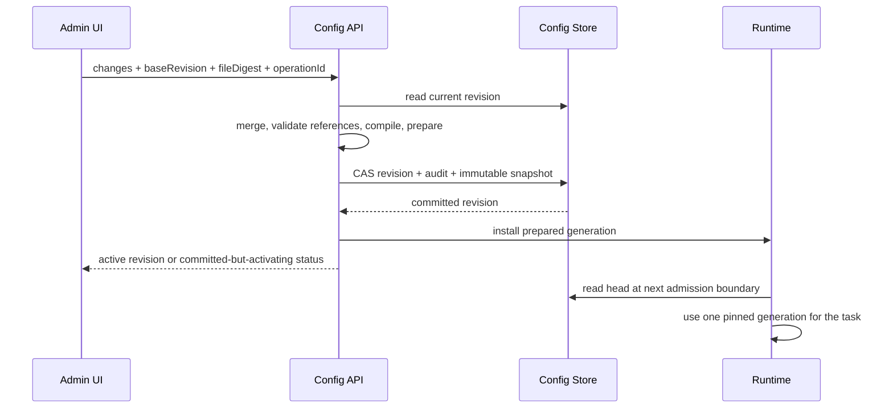

# Workspace 规则、动态配置与数据库迁移设计

状态：P0–P1 已完成实现与验收。P1 已补齐来源描述符、完整快照、运行/记忆隔离、只读策略回退及 Windows/Linux 和真实 VCS 验收；workspace 级 agent/sandbox 配置覆盖仍按原计划在 P4 接线，P2–P8 待推进。 下文未交付部分仍为目标合同，证据以[测试计划](../plans/2026-09-11-workspace-config-tests.md)为准。
源码核对基线为 `e609cd7`;外部资料核对日期为 2026-09-11。

执行入口：[执行计划](../plans/2026-09-11-workspace-config-implementation.md)、
[测试计划](../plans/2026-09-11-workspace-config-tests.md)、[路线图](../../../Plan.md)。
现有行为仍以 [config.ts](../../../packages/core/src/config.ts)、
[bootstrap.ts](../../../packages/server/src/bootstrap.ts) 和消费者实现为准。

## 1. 目标与范围

一条 workspace 规则可以接收多个工程，按来源元数据计算独立工作目录。管理页面同时展示文件配置和数据库配置；数据库记录可以创建、修改、停用、删除，成功发布后新任务立即使用新版本。旧数据库随程序启动自动迁移，迁移失败不暴露半升级状态。

本轮只编写设计、执行计划、单元测试计划及示例注释，不实现功能、不运行数据库迁移、不发布服务。下文中的新增名称均为拟定合同。

设计采用以下边界：

- 保留 `workspaces.instances` 作为命名策略入口，增加匹配规则和按工程解析的运行实例，不要求用户为每个仓库复制整段配置。
- 文件的显式配置优先并锁定；数据库补充未定义的记录和字段。文件缺省值不算文件声明。此项是当前设计假设，数据库覆盖文件是可替代策略，不能在实现中混用两者。
- “立即生效”指配置发布成功后开始接收的新任务。已经接收的任务固定配置版本；页面显示仍使用旧版本的待执行和运行任务数量。
- SQLite、PostgreSQL、Redis 均纳入迁移设计。SQLite/PostgreSQL 承担关系型配置存储，Redis 也提供独立配置源后端，并覆盖其现有自动提交存储和缓存格式。memory 只用于测试或临时模式。
- PostgreSQL 当前只有配置入口，完整接入需要实现数据库适配和已有业务存储调用，列为必要执行阶段，不能以 schema 枚举或 mock 测试替代。
- 不新增通用脚本执行器、任意代码表达式、远程 MCP 配置平台、多租户权限系统，或已预留的 Kubernetes/Firecracker 后端。
- `scheduled` 当前有事件/schema 概念，本次不顺带实现新的周期触发引擎；只为已经存在的事件来源定义变量，管理界面必须显示组件是否实际可执行。

## 2. 已核实的现状

| 组件 | 源码事实 | 对设计的约束 |
| --- | --- | --- |
| 配置加载 | `core/src/config.ts` 的 `loadConfigFile` 读 YAML 后直接 `appConfigSchema.parse`；`mergeConfigLayers` 对对象递归合并、数组整体替换 | 新来源合并必须保留原始字段存在性；不能先给各来源填默认值 |
| Workspace | `workspaceInstanceSchema.source_repo` 只允许一个 `{ trigger, repo }`；没有目录表达式 | 增加规则时须兼容旧绑定和稳定 workspace ID |
| Git 仓库映射 | `server/src/webhook-common.ts` 的 `matchesWebhookRepo`、`resolveWorkspaceIdForRepo` 做忽略大小写的精确/后缀匹配，不是 glob | 旧 `repos[].match` 不得悄悄改为另一种语言 |
| 默认选中 | `bootstrap.ts:resolveWorkspaceIdFromTrigger` 会退回首个 workspace 或 `default` | 新规则模式不得把未匹配项目送进其他工程；旧回退需显式兼容 |
| 工作目录 | `buildSourceRootResolver` 使用 `workspaces/<id>/source/<repoRef 替换 / 和 :>`；`deriveWorkspaceRoot` 从目录名称反推根目录 | 必须把目录布局作为显式对象传递，覆盖 prompts、模板、context repos、agent、MCP、snapshot |
| 运行依赖 | `bootstrapServerApp` 启动时创建 webhook 配置、model route cache、sandbox、agent、queue 和 scheduler | 更换数据库对象不会使这些闭包动态更新；需版本化运行时依赖 |
| 模型组 | `llm.model_chain` 已是命名组；main、triage、summary、agent fallback 都依赖 bootstrap 的解析 | 管理界面必须编辑有序组并保持各分析路径一致 |
| 模型条目参数 | `resolveModelSpecFromChain` 当前只从条目读 provider/model，其余参数从 provider 读取 | 条目级 overrides 是本次新增接线，不能把现有 passthrough 接受当成已生效 |
| 输出路由 | `resolveOutputChannelNames` 按 rule、workspace、default、inline fallback 选择；空数组当前会继续回退 | 新路由需明确空数组的禁用语义，旧行为由兼容编译保留 |
| 自动提交 | `AutoCommitRuntime.accept` 先持久 receipt；scheduler 后台补全元数据；SQLite/Redis/memory 共享合同 | 不得在 HTTP 接收时新增 P4/SVN 元数据网络查询；不能重写已封存批次身份 |
| 业务数据库 | `store/src/database.ts` 是 `better-sqlite3` + Drizzle SQLite，已有 `001` 至 `006` migration；bootstrap 对所需 store 的非 SQLite 配置报错 | PostgreSQL 需真实驱动、SQL 方言和异步调用改造 |
| 调度迁移 | `core/src/sqlite-auto-commit-store.ts` 在 immediate transaction 中把调度 schema 从 1 升到 4 | 保留已有版本独立性及旧 receipt/checkpoint；不能另写冲突的初始化器 |
| Redis | 自动提交 Lua、BullMQ queue、模型目录缓存使用 Redis；未形成统一 migration ledger | 不能把 Redis 事务等同 SQL 回滚，也不能改 BullMQ 私有键结构 |
| 管理页 | `dashboard/dashboard.html` 是 Hono 托管的 HTML/JS；已有统计、项目、模型使用量、运行记录和管理员 Bearer session | 扩展现有管理入口，抽出可测试的配置表单模块；不为表单另建前端框架 |
| 管理鉴权 | `admin-auth.ts` 使用进程内 session Map；`observability-api.ts` 提供登录、登出及只读查询 | 多进程配置管理需共享 session 或可验证 session；不能声称现有会话天然跨副本 |
| 库与测试 | Handlebars `^4.7.9`、Zod `^3.25.76`、`re2-wasm` 已使用；根 Vitest 收集 `packages/*/test/**/*.test.ts` | 复用已选组件；UI 单测代码放入正式收集范围 |

证据来自上述函数及 [bootstrap 测试](../../../packages/server/test/bootstrap.test.ts)、
[配置测试](../../../packages/core/test/config.test.ts)、
[数据库测试](../../../packages/store/test/database.test.ts)、
[管理页路由测试](../../../packages/server/test/dashboard-routes.test.ts)、
[自动提交合同测试](../../../packages/core/test/auto-commit-store-conformance.ts)。本设计没有把这些测试的存在当成本轮执行结果。

## 3. 组件选择

| 问题 | 选择 | 原因与代价 |
| --- | --- | --- |
| 工作路径表达式 | 独立 `Handlebars.create()` 实例，AST 白名单和少量纯 helper | 已有依赖；支持变量、子表达式和严格模式。路径校验必须独立实现，HTML escaping 不能保护文件路径 [1], [2] |
| 匹配规则 | 复用 `re2-wasm` 及现有 glob 的语言合同，抽出最小共享 matcher | 不引入 micromatch 或另一套 regex 引擎；保留现有 `exclude_sources` 的语义和测试 |
| 配置校验 | 继续 Zod 3，按组件导出 schema 与字段定义 | 当前 Zod 4 有默认值/cross-field 兼容任务，不能作为本功能的隐含依赖 |
| 表单描述 | 小型、只描述编辑控件和映射的 `ConfigUiSpec`，最终校验仍在服务端 | 需要通用范式，但不另造完整 JSON Schema 表单引擎；纯映射函数必须完整单测 |
| SQL migration | 扩展现有有序 SQL migration，复用 Drizzle 和驱动 | 保留既有账本，支持受审查的 SQL/data transform；不在生产启动时使用 schema push [8] |
| PostgreSQL 驱动 | `pg` + 当前 Drizzle 的 `node-postgres` 适配 | 新增必要数据库驱动，不另加 ORM；事务必须使用同一个 client [13] |
| Redis migration | 复用 ioredis、受限 Lua、不可变版本记录和 CAS 头指针 | 脚本串行不等于失败自动回滚；避免写入一半的版本成为 active [5] |

`pnpm-lock.yaml` 虽有传递依赖 `zod-to-json-schema@3.25.2`，上游已声明停止维护，并在 2026-06-30 归档 [14]。本设计不把它升为配置 UI 的核心依赖，也不依赖 Zod 私有 `_def` 遍历。JSON Schema 的 `readOnly` 是注解，不能承担服务器写权限检查 [15]。

## 4. 配置源、优先级与版本

### 4.1 启动配置与业务配置

将配置划分为启动时的 bootstrap 配置和可发布的业务配置。两者仍从同一 YAML 入口读取；不强制拆文件。

| 类别 | 字段 | 管理页行为 |
| --- | --- | --- |
| 启动连接和信任边界 | `server.port/hostname/path_prefix/trust_proxy/auth`、`admin`、`storage` 连接、`queue.kind` 及连接、`config_sources`、`workspaces.root`、允许的 secret 引用和 sandbox 上限 | 可见、只读，修改文件并重启；禁止数据库写入 |
| 业务全局 | `llm`、`review`、`compression`、`agent`、输出默认策略、workspace defaults/cache、队列运行策略 | 未被文件声明的字段可由数据库管理，发布后按生效边界应用 |
| 命名实体 | providers、模型组、triggers、channels、workspace definitions、routing rules | 文件记录只读，数据库记录可 CRUD、停用、复制；引用必须有效 |
| 非配置数据 | 模型目录下载结果、运行统计、receipt、批次、reflection memory | 使用原有数据 API，不能混成可编辑配置 |

新增启动配置草案：

```yaml
# Planned schema; not accepted by the current release.
config_version: 2
config_sources:
  database:
    enabled: true
    backend: storage # storage | redis; memory is test/ephemeral only
    namespace: default
  migrations:
    mode: auto # auto | verify; verify requires a completed migration job
    lock_timeout_seconds: 30
  runtime:
    refresh_interval_seconds: 5 # background refresh; not the consistency barrier
workspaces:
  root: /app/data/workspaces
```

`backend: storage` 使用 `storage.database` 的 SQLite 或 PostgreSQL；`redis` 使用已配置的 Redis 连接，但独立 `config` namespace，不混入缓存 TTL/淘汰策略。Redis 用作配置真源时需要持久化和不淘汰配置键的部署设置；不能宣称内存 Redis 能提供断电持久性。

关闭数据库来源时只读文件，保持现有用法。启用时即使没有启用统计、reflection 或模型目录，也必须初始化配置存储。启用来源不可达时，不退回看似正常但路由不完整的文件配置；健康检查报告配置不可用。

### 4.2 合并与来源追踪

处理顺序为：读取原始 YAML 映射及文件位置，版本转换，读取一个数据库 revision，按实体/字段合并，再执行一次 Zod defaults 和全图校验，最后生成不可变有效配置。

合并规则：

1. 内置默认值最低，数据库记录居中，文件显式字段最高。继承层次在来源合并后另算，不用来源优先级替代 global/defaults/workspace/route 的业务优先级。
2. providers 按 `id`、triggers/channels 按 `name`、workspace/model groups 按映射键、rules 按 `id` 合并。文件拥有的命名实体整体锁定，数据库不能用同 ID 覆盖或补字段。
3. 全局对象和 defaults 按叶字段锁定；对象空映射没有锁定未声明子字段，显式空数组表示锁定为空。序列按整体替换，绝不按下标递归合并。
4. 缺省、继承、显式 `false`、`0`、`[]` 必须区分。删除数据库 override 表示恢复继承，不能把 JSON `null` 当成统一删除指令。
5. 数据库修改若触及文件锁定项，API 返回 `file_owned`，不接受“保存成功但被遮盖”的新修改。重启时文件新增同 ID 会使原数据库记录变为 shadowed，页面仍可查看、导出和删除该数据库记录，但不能改动文件对象。
6. 返回每个字段的 `source: file | database | default`、`sourcePath`、`editable`、`effectiveValue`、`overriddenValues`。敏感值仅返回引用名或已设置状态。
7. 文件不自动导入数据库。提供“复制为数据库配置”，要求新 ID，并展示引用修改；迁移仅转换内存中的文件表示，原文件逐字节不变。

同名冲突和字段锁定由服务端强制执行。字段可见但禁用按钮只是界面表现。纯层 `set` 校验目标路径与文件锁的祖先、后代交集；数组只能整体替换。`unset` 可移除被文件遮盖的数据库 override，保持文件有效值不变。数据库模型组的 value 保留有序条目数组，其他实体使用对象；记录映射键必须等于不可变 record ID。

模型条目新增可选 `overrides`，字段复用请求参数 schema：`extra_params`、`extra_body`、`extra_headers`、`reasoning_effort`、`thinking_level`、`thinking_budget_tokens`、`thinking`、`response_format`、`tool_choice`、`parallel_tool_calls`、`seed`、`logit_bias`、`drop_params`、`allowed_openai_params`。不得覆盖 provider ID/kind、endpoint 或凭据；这些由 provider 实体管理。token/temperature/top_p 等 provider 专属请求项在 `extra_params` 中按已验证能力校验。空 overrides 继承 provider，map 按 key 合并、数组替换；禁用参数通过 drop_params 表达，不用 null 删除。

解析顺序为 catalog 元数据 → `model_catalog.overrides` → provider 显式参数/能力 → 当前模型条目的请求 overrides。main、fallback、summary、triage、resolution 必须从同一条目生成 ModelSpec。目录 metadata 与请求参数在 UI 中分组，模型条目不允许更改目录价格和能力事实。

### 4.3 持久模型

配置量小于审查数据量，采用不可变 revision 文档与 CAS 头指针，不把每个配置字段设计成一张表。对外仍提供类型化实体编辑，发布时一次保存整组变更。

| 对象 | 最小字段 | 约束 |
| --- | --- | --- |
| `config_revisions` | namespace、revision、parentRevision、formatVersion、document、contentHash、fileDigest、createdAt、actor、operationId | `(namespace, revision)` 和 operationId 唯一；document 只含数据库配置和引用，不含已解析 secret |
| `config_heads` | namespace、activeRevision、generation | CAS 更新；generation 使用跨后端安全整数表示，API 用十进制字符串 |
| `config_audit` | operationId、before/after revision、action、entityRefs、redactedDiff、actor、timestamp | 与发布同一事务/原子提交；不记录 secret、原始 webhook 或包含凭据的 URL |
| `config_runtime_snapshots` | id、fileDigest、databaseRevision、resolverVersion、sanitizedEffectiveConfig、contentHash | 持久任务固定整个文件+数据库组合；引用和保留期限受任务生命周期约束 |
| `workspace_bindings` | instanceId、definitionId、canonicalProjectKey、layoutVersion、relativeRoot、createdAt、lastSeenAt、state | 全身份唯一；路径唯一；definition 移除不能删除历史运行数据 |
| `schema_migrations` | namespace、id、checksum、from/to、appVersion、appliedAt | 区分业务 store、config、auto-commit、queue-owned、catalog 格式版本 |

SQLite 使用 JSON text 和整数时间；PostgreSQL 使用 JSONB/BIGINT 或明确类型转换，API 时间统一 UTC ISO 字符串。Redis 保存不可变 JSON revision、snapshot、审计和 binding 数据，head 为短小字符串；所有原子相关键使用同一 `{namespace}` hash tag。配置 source 和 queue 可以在不同后端，不能假设存在跨库事务。

新版本为每条数据库记录保留稳定 ID、enabled 状态和来源，删除产生新 revision；旧 revision 按引用和保留策略清理。回滚是用历史文档创建一个更高 revision，重新验证当前文件和依赖，不回退 head 计数。

## 5. Workspace 多工程规则

### 5.1 用户模型与拟定配置

保留 `workspaces.instances.<definition_id>`。一个 definition 表示共用的 review/model/agent/output 策略；每个实际工程生成独立的 `workspaceInstanceId`。`ReviewEvent.workspaceId` 继续保存策略 ID以兼容现有引用，新增解析上下文保存 instance ID，后续明确按哪一级计算并发、记忆和目录。

v2 新 definition ID 使用 `[A-Za-z0-9][A-Za-z0-9._-]{0,127}`，并排除保留根键；旧 ID 不自动重命名。模板直接输出 ID 前仍做路径段验证，旧 ID 需要编码时使用 `segment`，不把“配置 ID”天然视为安全路径。

v2 的 workspace `agent` 从现有仅 `default` 扩展为 `default/timeout_seconds/auto_approve/context_compaction/web_search`，复用全局 agent 对应字段 schema，但不提前填默认值以免破坏继承。已有 workspace 顶层 `sandbox` 继续保留并映射到有效 `agent.sandbox`，禁止再声明重复的 `workspace.agent.sandbox`。global → defaults → definition → route 的合并均受文件信任上限约束。

```yaml
# Planned schema; not accepted by the current release.
workspaces:
  instances:
    product-services:
      match:
        - id: github-services
          triggers: [github-main]
          source:
            repo_ref: { glob: "acme/service-*" }
        - id: gitlab-services
          triggers: [gitlab-main]
          source:
            repo_ref: { glob: "acme/platform/*" }
      work_path: '{{segment trigger.name}}/{{segment source.namespace}}/{{segment source.repository}}'
      model_chain: thorough
      agent:
        default: opencode
      review:
        max_files: 80
    engine-streams:
      match:
        - id: p4-engine
          triggers: [p4-main]
          source:
            repo_ref: { glob: "//Engine/*" }
      work_path: '{{segment trigger.name}}/{{segment p4.depot}}/{{segment (default p4.stream "classic")}}'
```

单个 definition 的 `match` 条目之间为 OR；条目内的 triggers、source 条件为 AND；数组触发器为 OR。优先级由顶层 routing 选择，不靠对象遍历顺序。`source_repo` 和 `match` 互斥，旧 `source_repo` 编译成一条精确绑定规则。

matcher 为 `{ exact } | { glob, ignore_case? } | { regex, ignore_case? }`，不允许同时设置两种。glob 沿用现有全字段语义：`*` 匹配任意数量字符（包括 `/`），`?` 匹配一个 Unicode code point；无 extglob、brace、字符类或“单星只匹配一级目录”的隐式行为。regex 使用 RE2、默认子串语义，要求完整字段时写 `^...$`。默认区分大小写，不改变持久身份的原始大小写。

限制沿用已核实的 matcher 边界：最多 128 条/组，单表达式 1 KiB、字段 4 KiB、表达式总量 64 KiB；编译缓存按配置 revision 生命周期释放。多个 definition 命中时，必须有明确 routing 选中目标；没有路由或唯一候选时报告歧义，不任选一个。

### 5.2 接收与元数据分层

签名/鉴权成功后，从来源白名单建立 `SourceDescriptor`，再匹配 workspace/routing。原始 payload 不进入模板上下文。metadata 字段标注 `verified_payload`、`configured`、`vcs_verified`、`unavailable` 或 `conflicted`，避免把提交人提示当成已验证事实。

HTTP 路由只使用已存在的 repo、ref、trigger 等字段。P4 stream/client、SVN UUID/目录等需要命令的值在后台解析后才能用于目录模板。路由依赖尚不可用的字段时，持久化最小待解析 receipt，后台重试后再建立绑定；不允许在 HTTP 层拿服务账户信息填空，也不丢掉通知。新增 receipt 阶段必须有独立 schema 和稳定 delivery identity，不能伪造 default workspace 进入既有批次。

GitHub/GitLab PR/MR 以目标仓库作为工程边界，head/source 仓库另存，避免 fork PR 写入另一工程。GitLab namespace 保留完整多级路径。P4 多 depot/classic client 不假造单一 stream；一个 changelist 跨匹配 scope 时，按配置的 scope 分解为独立 receipt，并保留父 delivery ID。SVN branch 不是通用协议属性，只有配置明确 project/branch roots 后才提供。

### 5.3 路径模板变量目录

以下是拟定白名单。`R` 表示该来源必需，`O` 表示可缺省；缺省字段在上下文里显式置 `null`。使用者需通过 `default` 指定缺省值，不能将不存在的值渲染为空目录。所有数值为稳定十进制字符串，URL 在入库前移除 userinfo/query 中凭据。

| 命名空间 | 可用变量 | 类型/可用性与事实来源 |
| --- | --- | --- |
| `trigger` | `name`、`kind`、`host` | name/kind R，host O；来自已鉴权配置 profile，host 不含凭据 |
| `source` | `vcs`、`repo_ref`、`repository`、`namespace`、`project_key`、`branch`、`ref` | vcs/repo_ref/project_key R；repository/namespace 按 VCS 归一；branch/ref O，不能用 SHA 冒充分支 |
| `workspace` | `id`、`instance_id` | R；策略 ID 与完整实例 hash，来自解析器；模板不能指定或改变它们 |
| `event` | `provider`、`kind`、`name`、`action`、`target_id`、`base_revision`、`head_revision`、`actor` | provider/kind/name R，其他 O；归一事件与白名单来源字段。actor 仅用于展示/路径，不授权 |
| `git` | `owner`、`repository`、`full_name`、`namespace`、`branch`、`ref`、`base_branch`、`head_branch`、`default_branch`、`head_repository`、`head_owner` | Git 来源专用；push 的 branch 来自 `refs/heads/`，tag 的 branch 为 null；PR 的 branch=head_branch，owner/repository 指 base repository |
| `github` | `owner`、`repository`、`repository_id`、`full_name`、`branch`、`base_branch`、`head_branch`、`pull_number`、`issue_number`、`installation_id` | 公共 Git 字段的来源别名及 provider ID；编号/installation O；issue 事件不能假定 branch 存在 [9] |
| `gitea` / `forgejo` | `owner`、`repository`、`repository_id`、`full_name`、`branch`、`base_branch`、`head_branch`、`pull_number`、`issue_number` | 只开放实际 profile 对应命名空间；不制造 GitHub installation [11], [12] |
| `gitlab` | `namespace`、`project`、`project_id`、`path_with_namespace`、`branch`、`source_branch`、`target_branch`、`source_project_id`、`target_project_id`、`merge_request_iid`、`issue_iid` | namespace 完整保留 subgroup；iid 是项目内编号，不混用全局 id；source/target 按 MR 语义 [10] |
| `p4` | `server`、`depot`、`depot_path`、`stream`、`stream_name`、`client`、`service_client`、`user`、`change`、`scope` | server/scope 来自已选 profile；depot 来自经验证 scope；client/user 取 changelist 元数据，service_client 单独表示 AICR client；stream O，需配置精确绑定或 client/stream 元数据验证 [16] |
| `svn` | `repository_url`、`repository_root`、`repository_uuid`、`repository`、`project_path`、`branch`、`revision`、`author` | URL 来源于允许的配置映射；root/UUID 来自 `svn info --xml`；project_path/branch 仅在显式布局下存在；author 来自版本属性 [17] |
| `manual` | `request_id`、`requested_workspace`、`requested_by` | 仅手工入口；来自鉴权请求/CLI 结构化输入，不能读主机 cwd、任意 env 或参数文本 |
| `scheduled` | `job_id`、`schedule_id`、`scheduled_at`、`timezone` | 仅存在受信定时事件信封时提供；当前没有完整管理型定时引擎，UI 标记 unavailable |

路径模板可跨来源使用 `source.*`，专用模板使用 `github.*`、`p4.*` 等。没有同名顶层 alias，以免 `workspace` 在 P4 client 和 AICR workspace 之间混淆。事件相关字段会导致工作目录按事件分散，预览显示该后果；推荐模板只使用稳定工程标识。

provider adapter 提供统一 `variableDescriptors()`：字段名、类型、事件范围、可空性、获取阶段、样例值。UI 补全、后台 AST 校验、example 注释和文档变量表使用同一目录，测试验证目录与消费者一致。新来源未实现提取和 fixture 测试前不能只登记变量名。

来源专属变量保留在 adapter 注册的模板上下文中；公共 `ReviewEvent`、CLI 和输出 `TemplateContext` 继续使用平台中立字段，不复制一套 github/p4/svn 固定属性到每个公共接口。

### 5.4 表达式语言和目录保护

| 语法/helper | 合同 |
| --- | --- |
| `{{segment source.repository}}` | 将标量转为一个可移植路径段；非空、拒绝 NUL/控制字符、`.`/`..`、设备名和尾随点/空格；需要替换的字符用固定编码并附原值 hash，不能仅替换成 `_` |
| `{{segment (default git.branch "unscoped")}}` | null 或空字符串取显式字面量缺省；不把 0/false 当缺省 |
| `{{hash source.project_key}}` | SHA-256 十六进制值，固定长度；完整身份仍另存，不依赖短 hash 唯一性 |
| `{{lower ...}}` | 只转换显示目录片段，不改变工程/调度身份；必须置于 segment 内 |
| `/`、普通路径段 | `/` 为跨平台分隔符；模板输出必须相对于 `workspaces.root`，不接受绝对路径、盘符、UNC、反斜线或 `%` 二次解码 |

只允许纯变量、上述 helper 和受限子表达式；不支持 block、partial、decorator、`lookup`、`log`、动态 helper、`@data`、`../`、原型属性或任意 JS。禁止 `constructor`、`prototype`、`__proto__` 路径。直接输出事件变量必须包在 `segment`/`hash` 中，固定安全的 `workspace.id/instance_id` 除外。

AST 校验后以 `strict: true`、`knownHelpersOnly: true`、`noEscape: true` 编译，显式保持原型访问关闭。`noEscape` 用于避免 HTML 实体污染路径；安全来自白名单与路径校验 [1], [2]。helper 参数个数固定，`default` 的第二参数必须为标量字面量，输出必须包在 `segment/hash` 内；拒绝 hash arguments。表达式长度上限 4 KiB、AST 256 节点、深度 8；超限在发布阶段拒绝，实际变量超限在接收或后台解析阶段明确报错。

对最终路径同时执行 `path.resolve`/`path.relative` 边界检查以及已有父目录的 realpath 检查。拒绝指向根外的 symlink/junction；执行前重新验证，agent 不得写 workspace 根及其父目录。Node 的 `resolve` 会被绝对路径重置，仅调用 resolve 不构成包含性检查 [18]。渲染后的相对路径上限 4096 UTF-8 字节，单段上限 255 UTF-8 字节；文字路径段同样拒绝 Windows 设备名（含扩展名）、非法字符和尾随点/空格。实际完整路径还受主机能力限制，Windows 与 Linux 单独验收。

### 5.5 运行实例、目录和隔离

`workspaceInstanceId = hashStructured(["workspace-instance", 1, definitionId, triggerName, vcs, canonicalProjectKey])`。Git 工程 key 包含来源实例和目标仓库；P4 包含服务器及配置 scope/stream；SVN 包含 canonical root/project scope。Git branch 默认不改变实例身份，但可改变 work_path；工作路径变更不改变统计身份。

最终工作根为 `<workspaces.root>/<rendered work_path>/<workspaceInstanceId>`。固定实例后缀防止多个仓库模板结果相同时共用源码、memory 或可写运行目录；预览必须展示完整最终路径，不只展示模板片段。默认 work_path 为 `{{workspace.id}}`。

传递显式 `WorkspaceLayout`：`instanceRoot`、`sourceRoot`、`agentDir`、`tmpDir`、`contextReposDir`、`templatesDir`。每次执行写入 `runs/<runId>/` 下的 source/agent/tmp/context-repos；运行目录由整次 orchestration 持有，模型回退、上下文复核和发布结束后才清理。陈旧目录仅在记录的本机 owner 进程已退出时回收，未知或其他主机 owner 保留。仓库缓存可另行复用，但可变 Git checkout、P4 client root、MCP state、HOME/XDG 不共享。P4 实际服务 client 需按 instance/run 唯一化或持有互斥租约，不能同时修改同一 client spec。

模型组和 review defaults 继承策略 ID；reflection、源码缓存、运行目录按工程实例隔离；现有 per-workspace 并发默认仍作用于 definition，另以实例可写目录租约防止冲突。统计保留原 workspace ID/repoRef，并增加 instance ID。`softDeleteMissingProjects` 必须根据存活 definition/binding 判断，不能把通配规则下没有写入静态配置的工程视为已删除。

旧配置继续使用 `legacy_v1` 布局且维持 workspace ID/receipt/stream identity。新规则采用 `isolated_v2`。改路径只影响新 run，旧目录保留至无运行引用后按 retention 清理；不自动搬动正在使用的目录。旧 `templates/` 和 operator skills 以策略目录作为只读 fallback，不因新目录布局丢失。

## 6. 触发、分析与输出路由

新增 `routing.rules`，使用显式 priority 和稳定 id。一条路由选择一个 workspace definition 和分析参数，再引用已有输出 channel 名称。保留 outputs 自身的渲染、聚合、生命周期与 no-problems 合同。

```yaml
# Planned schema; not accepted by the current release.
routing:
  rules:
    - id: github-pull-reviews
      enabled: true
      priority: 100
      match:
        triggers: [github-main]
        target_kinds: [pull_request]
        source:
          repo_ref: { glob: "acme/service-*" }
      workspace: product-services
      analysis:
        model_chain: thorough
        triage_model_chain: lifecycle
        agent:
          default: opencode
      outputs:
        line_comments: [github-review]
        summary: [github-review, review-chat]
```

route 内各条件为 AND，列表元素为 OR；按 priority 降序命中，最高优先级相同且结果冲突则报 `ambiguous_route`。同一事件只执行一次分析，多 channel 输出属于同次执行。实现阶段不增加隐式 fan-out；P4/SVN 按工程 scope 拆分不算同工程多路分析。

workspace 必须也允许该来源，route 不能扩大 trigger 允许的仓库范围。无法匹配返回可解释的 `repository_not_configured`/`no_route`，不使用首个 workspace。删除有入站引用的 trigger、被模型组引用的 provider、被 route 引用的 workspace/channel，需要在同一次事务修复引用；不静默删边。

分析值优先级：global → workspace defaults → definition → route 明确设置。输出 channel 选择优先级：route 显式字段 → workspace 显式字段 → workspace defaults → outputs.routes.default；`[]` 明确关闭，未设置才继承。`no_problems` 继续按既有 built-in/global/channel/defaults/workspace/channel override 顺序计算，route 不再叠加另一套 no-problems 字段。

`routing.rules[].analysis` 只允许 `model_chain`、`triage_model_chain`、`agent`、`sandbox`、`review`、`compression`，复用对应可继承 schema；不接受 provider 凭据、VCS 连接或任意执行命令。workspace `triage` 的 enabled/actions/categories_close/custom_prompt/dry_run 仍控制问题分诊行为，模型引用与行为开关分开管理。

旧 `triggers[].repos`、`source_repo`、`outputs.routes` 由 compatibility compiler 生成内部执行图，保留旧数组顺序和空数组回退语义。配置格式升级不会自动把旧部署切到新 priority 规则；管理页提供转换预览并显示行为差异，用户提交后才采用新规则。v2 显式 routing 与旧声明不可同时控制同一条 trigger 路径，校验冲突。

发布预检覆盖 channel/事件兼容：PR/MR inline 需要 PR/MR 编号；managed issue 可用于 commit/push；Feishu/WeCom 是汇总输出。跨 trigger 的凭据绑定不可被 workspace 名称替代。模型 failover、压缩摘要、triage 和问题解决验证使用同一解析版本，重建 runtime bundle 时带上实际候选模型。

## 7. 配置发布与立即生效

### 7.1 发布事务



候选 prepare 执行结构校验、路径/regex 编译、依赖引用解析、环境引用可用性检查和本地 adapter 能力检查，不发送 review、不创建远端 webhook、不调用付费模型、不自动拉取容器镜像。需远端验证的凭据显示 unverified；不能把网络探测失败和 schema 无效混为一谈。

配置保存支持一个原子 changeset：例如 provider + model group + route 一次提交。写入携带 `baseRevision`、`fileDigest`、`operationId`；并发修改返回 `revision_conflict` 和可比较的差异，同 operationId 重试返回同结果。

数据库 commit 是持久配置的线性化点。prepare 失败不提交；commit 成功但响应丢失时按 operationId 查询，不能重复创建 revision。commit 后本机安装失败，返回/查询 `committed_activating` 和错误，进程停止接收新任务并重建已提交版本，不谎报 rollback。普通成功响应需本地 active；多副本状态单独报告。

### 7.2 RuntimeSnapshot 生命周期

将 bootstrap 中捕获 AppConfig 的长生命周期闭包改为 `RuntimeConfigManager` 管理的 generation。一个 generation 拥有 trigger registry、模型组解析/clients、catalog overrides、publisher factories、workspace/path resolver、agent/sandbox factories、review policy 和资源清理函数。

每个任务只取一次 `ResolvedExecutionPlan`，其内容包含 `configSnapshotId`、databaseRevision、fileDigest、workspace definition/instance、routeId、目录布局、完整模型组和输出绑定。后续 VCS、direct LLM、agent、compression、triage、resolution、MCP、输出和 run snapshot 全部使用该对象，不回头读取可变 global config。

| 修改面 | 生效位置 | 已接收工作 |
| --- | --- | --- |
| trigger 新增/删除/secret 引用/仓库范围 | 下一次请求鉴权与 route selection；使用固定 Hono dispatcher 查询当前 registry | 已固定信封与 profile 的任务继续；凭据失效按实际错误处理 |
| provider/model group/参数/agent/search/sandbox | 下一次接收的任务使用新 execution plan | 同一次 run 的 fallback/repair 也固定旧版本，不复用新旧 bundle |
| review/输出/workspace/routing | 下一次接收；按新 graph 编译 | 旧任务使用固定版本；不变更未知远端发布结果 |
| 调度 delay/exclusion/grouping | 新 receipt 固定 policy version；版本变化形成组批边界 | 不重置旧 receipt 的 firstAcceptedAt，不改 sealed members |
| 队列并发/速率等运行限制 | 新增 claim 前读取当前约束 | 降低限制不取消已运行任务；不得因重建 limiter 清空日预算账本 |
| 连接、端口、路径根、鉴权根配置 | 重启 | UI 禁止数据库编辑 |

跨后端没有原子事务时先持久 immutable runtime snapshot 和 admission pin，再写 receipt/job 对该 snapshot 的引用，最后将 pin 关联到持久任务；崩溃可遗留无引用 snapshot，不允许存在已签收任务但找不到 snapshot。孤立 pin 的回收必须核对对应 receipt 后端和 operation 状态，不按时间一到就删除；后端不可达时延迟 GC。配置版本变化不得把 upstream 同一 delivery 当成新事件重新接受；delivery dedup key 不包含 config revision，首次接收绑定生效。组批必须按 execution snapshot/policy 边界分区，去重身份仍保留现有 revision/member 规则。

同一 revision 已成为某 stream 的 member 后，后到 receipt 覆盖该 revision 时沿用已有 member/snapshot 归属；只给尚未出现的 revision 分配新 snapshot。scheduler 在固定 assembly frontier 内按成员顺序分段执行，前段未完成不抢占后段 active batch，避免增加配置边界后丢掉跨通知去重和恢复顺序。

旧 receipt/job 没有 snapshot 时，在首次升级暂停 claim 的阶段统一绑定一个 `legacy_import` snapshot，并记录来源版本；不为每次 retry 随意选择当前配置。历史 run 如缺可重建字段标为 legacy，未知 publication outcome 仍按原有保护处理。

generation 引用计数为零后释放 client、catalog 定时器、连接和 adapter 资源；queue/store 等共享长生命周期资源不随每次配置更新重建。预算、速率计数和调度租约不归 generation 所有，避免保存配置绕过限制。

### 7.3 多进程一致性

后台通知加速更新，但不承诺只靠通知实现立即生效：Redis Pub/Sub 可能丢消息 [6]；PostgreSQL NOTIFY 在事务提交后才投递 [7]。每次入站 admission 和开始执行持久任务前读取 durable head；若本地版本落后则加载/编译，失败返回 503 或暂停 claim。已 pin 的任务按其版本继续。

配置发布成功后，任一副本新接收的任务要么看到新版本，要么暂不可接收，不允许无期限用旧路由。各副本必须使用同一个文件 digest，否则 readiness/config API 报 `file_config_mismatch`，不能根据不同文件合成同名 revision。运行中已 pin 的旧任务不受文件更新驱逐。

SQLite 仅支持共享同一个本地数据库文件的进程；不同主机各自的 SQLite 文件不构成同一配置集群。PostgreSQL/Redis 可跨主机；不把 Pub/Sub 当持久日志。

## 8. 管理 UI 与通用表单合同

### 8.1 信息结构与操作

沿用 `/dashboard` 和 `server.path_prefix`。新增“配置”主导航，左侧按对象分组，主体用可筛选表格、右侧编辑面板。文件/数据库来源、状态、引用数、最后修改时间和当前生效 revision 为扫描字段。保留现有统计视图，不把“模型使用量”当成 provider 配置页。

创建流程：选择组件类型 → 填必需字段 → 引用现有配置或在同一 changeset 内新建 → 预览有效值/匹配样例 → 保存并应用。普通单项保存直接发布；涉及关联修改时支持“暂存到本次变更”，统一提交。取消编辑不写数据库。

文件记录隐藏修改/删除命令，显示来源文件及字段位置，允许查看脱敏原文和复制新 ID。继承字段显示当前有效值和来源，提供“继承/覆盖”的显式状态；不把空输入自动变成继承。配置未启用、管理员未配置、数据库不可达、空数据、校验错误、并发冲突、已提交未激活均有独立状态。

### 8.2 组件字段与控件

| 页面 | 编辑面与控件 | 依赖/错误预防 |
| --- | --- | --- |
| LLM providers | kind 下拉；id；base URL；env secret 引用；Azure api_version；Vertex project/location/credentials；Bedrock region/profile/credential env；Anthropic version/beta；timeout/retry；高级请求参数表 | 8 个已定义 kind 按实际消费者显示字段；URL/数值验证；id 被引用时禁直接重命名，提供原子 rename |
| 模型组 | group 名；有序 provider/model 行；role 下拉；默认/triage 组引用；行内参数覆盖 | 空组、失效 provider、重复 group 拒绝；上移/下移图标按钮与键盘操作；模型候选来自当前 catalog，可输入自定义模型 |
| 模型覆盖 | 区分 provider 请求参数、chain entry 参数与 `model_catalog.overrides` 元数据；价格、token 限制、能力开关、reasoning enum、extra_params/body/headers | 显示有效 ModelSpec 及来源；不把目录价格当请求参数，不将 provider 默认值盖过 entry 显式值；catalog 缺信息不编造 |
| Git trigger | gitea/forgejo/github/gitlab；base URL、token/env、signature/env、事件和仓库绑定；GitHub App 专属 app id/client id/private key 引用/installation | GitHub App 与 token 鉴权方式分组；入站 secret 与出站 token 分开；repo 预览保留 GitLab subgroup |
| P4 trigger | port、user/ticket/password env、service workspace、depot_path/streams、watch_path/include_cr_file/exclude_cr_file；scope 规则 | 选 stream 时显示完整 `//depot/stream`；submitter client 与 service client 分栏；不把 `streams[0]` 当所有事件 scope |
| SVN trigger | repository_url、用户名/密码引用、trust_server_cert、文件过滤、project roots | repository_url 必须来自配置白名单；不允许 payload 选择任意 URL |
| Manual/scheduled | 显示实际入口和可用事件字段 | manual 与 CLI 合同一致；scheduled 缺运行引擎时 disabled，并明确缺什么 |
| 输出 channels | 9 个已实现 kind；trigger 引用；mention/no_problems；PR review mode/event/update strategy；issue mode/labels/resolved action/owner；Feishu/WeCom webhook/env | 仅展示对应 kind 参数；URL 模板与文件路径模板分开；凭据/必需事件字段缺失阻止发布；既有自定义 passthrough 字段先做能力清单 |
| 路由 | 有序规则表、priority、trigger/target/source 条件、workspace、模型组、agent 及 line/summary channel 多选 | 测试事件预览从 trigger 到路径/模型/输出全链；歧义显示冲突规则；不需要拖拽画布 |
| Agent/search | 7 个 adapter 下拉；timeout/auto_approve；context compaction；search enabled/providers/exclude/timeout/credentials/searxng | capability registry 控制可选项；不支持的字段明确 disabled，不能保存后仅靠日志提示被忽略 |
| Sandbox | native/docker/podman/docker_socket，engine 和 image；显示有效 engine 与 preflight 状态 | k8s_pod/firecracker 标为预留不可选；缺已明确要求的容器后端不静默降级 native；信任上限由文件锁定 |
| Review 全局 | include/exclude、max_files/max_patch_bytes、语言、incremental/skip_lgtm、commit strategy、git.allow_deepen、labels、problem_issue、fetch_extra、reflection、auto_commit；compression 独立组 | glob 列表、数字单位/步进、布尔开关；auto_commit 的周计划、时区、排除规则使用现有 schema 和下一执行时间预览 |
| Workspaces | defaults 和实例定义；source_repo 或 match；path template；模型/agent/search/sandbox/review/triage/outputs/auth/prompt/context repositories | 必需变量提示，测试多个 repo/ref；triage 类别/close/dry_run 独立编辑；显示实际绑定和目录，不编辑自动生成 instance ID |
| 配置版本 | 变更历史、脱敏 diff、引用影响、应用状态、恢复历史版本 | 恢复会生成新 revision；不运行数据库 downgrade，不把远端发布重新执行 |

Review 的每个字段需形成“schema → resolver → consumer → UI → tests”清单；当前只有 schema、未证明消费的选项显示 unavailable，执行阶段应补接线或保留明确只读状态，不能把新增表单视为已支持。用户要求的全局 review、workspace agent/sandbox/search 则必须在本任务中完成实际接线。

已核对 agent 搜索能力：Kilo 为 Exa 配置；OpenCode 支持 Exa/Parallel 选择；oh-my-pi 支持 provider 顺序、排除、超时和 SearXNG；Claude Code/Copilot CLI 仅消费开关；Zoo/pi 没有当前集成的内置搜索面。能力源是 `packages/agents/src/web-search.ts` 与各 adapter，不从名字推断。直接 LLM 模式不因勾选搜索就自动获得 agent 的搜索工具。

### 8.3 ConfigUiSpec

这是配置编辑的有限描述协议，不是可编程 UI。定义与组件 schema 相邻，运行时下发可序列化部分；引用数据由专用 options API 获取。

```typescript
// Proposed types, not current exports.
interface ConfigUiField {
  id: string;
  path: readonly string[]; // validated tokens, never eval or a JS property expression
  control: "text" | "number" | "toggle" | "select" | "multiselect"
    | "ordered-list" | "map" | "secret-ref" | "matcher" | "path-template";
  labelKey: string;
  section: string;
  optional: boolean;
  binding: "value" | "inherit-or-override";
  optionsSource?: string;
  visibleWhen?: { field: string; equals: string | boolean };
  capability?: string;
}
```

仅提供 `decodeDraft`、`encodeChanges`、`resolveFieldState`、`resolveOptions`、`validateUiSpec` 五类纯函数。path token 必须在已登记写入路径白名单内，拒绝原型键；不支持 JS 表达式、任意 JSONPath 或服务器下发代码。组件 registry 引用同一字段 schema/default/enum；UI 只保存布局、label、控件和引用关系，不复制业务校验函数。

通用 renderer 负责标量、数组、记录、继承和错误；模型组排序、路由测试、周计划和路径预览是显式专用控件。条件隐藏字段保留草稿但不作为新 variant 的写入内容；切换 kind 显示将移除的字段，返回原 kind 可恢复未提交草稿。未识别旧扩展字段只读展示/无损保留；不能因表单重存丢失 passthrough 数据。

服务端发布时始终重跑具体组件 Zod schema、引用校验、文件锁、capability checks 和运行图编译。`readonly` 与 capability 不是浏览器可覆盖的权限声明。API 字段错误返回 `{ entity, path, code, message }`，前端将 path 定位到控件。

范式的所有导出函数、控件类型、映射分支和异常分支要求 100% statements/branches/functions/lines，另以业务 fixture 验证读写往返。不能通过大 snapshot 或导入覆盖率冒充完整测试，详细用例见测试计划。

### 8.4 管理 API 与敏感信息

| 拟定 API（均在 `/api/admin/config` 下） | 合同 |
| --- | --- |
| `GET /` | 脱敏配置视图、effective values、来源和 active revision；分页实体列表 |
| `GET /schema` | ConfigUiSpec、组件 capability 和协议版本；不含 secret 值 |
| `POST /validate` | 校验 changeset，返回字段/引用错误和影响预览；不落库、不调用外部分析 |
| `POST /preview-route` | 使用 fixture 或脱敏事件描述展示匹配、变量、目录、模型、输出；默认无网络/文件写入 |
| `POST /changesets` | baseRevision/fileDigest/operationId + create/update/delete/enable 操作；原子发布 |
| `GET /operations/:id` | 网络响应丢失后查询同次操作状态 |
| `GET /revisions`、`GET /revisions/:revision` | 审计历史、脱敏配置 diff |
| `POST /revisions/:revision/restore` | 以当前 head 为父创建新 revision，仍做文件锁及引用校验 |
| `GET /status` | 当前 DB/file/runtime/schema 版本、各实例激活状态、迁移失败原因 |

沿用管理员登录入口，并把配置 API 与统计 store 依赖拆开：有管理员和配置后端即可管理配置。缺少管理员配置时接口不可用；普通 webhook/workspace API key 不能写配置。

本阶段 secret 只支持环境变量/已配置 secret reference，不增加明文凭据库。编辑时输入引用名，页面可显示存在/缺失，不能返回 env 值；不得允许枚举所有进程环境变量或把任意 env 引用转发到任意外部 URL。bootstrap 提供可用 secret 名和目标用途 allowlist，新增敏感引用超出范围需修改部署配置。高级 headers/body 中敏感字段使用同一 secret-ref 机制或拒绝原文持久化。

管理员 session 多实例使用配置 store 的独立短期 session 表/键存 hash 和过期时间，原始 token 只交给浏览器，登出撤销；不存入配置 revision。保持当前 Bearer 协议以控制范围，增加写操作来源校验、请求大小限制、审计和过期处理。错误、diff、导出、日志、runtime bundle 都用同一脱敏规则。UI 动态值按文本节点渲染，防止 repo/配置内容进入 `innerHTML`。

## 9. 自动迁移

### 9.1 三种版本必须分开

`schemaVersion` 表示数据库结构；`formatVersion` 表示配置文档；`revision` 表示一次业务修改。另有 `resolverVersion`/`layoutVersion` 表示解析和目录合同。不能用应用 semver 直接充当 schema 版本，不能发布一次配置就执行 DDL。

统一 `MigrationRunner` 组织有序 migration 清单，每项含 namespace、id、checksum、from/to、最低读取/写入协议、事务模式和实现。使用既有库完成 SQL 或 Redis 操作，不把全部后端伪装成同一个 SQL transaction API。

### 9.2 启动流程

1. 只解析 bootstrap 连接和版本信息，建立目标连接。
2. 获取对应 namespace 的迁移锁；在锁内重新读取版本和已执行账本。
3. 检查未知更高版本、checksum 差异、序列缺口和旧版本兼容性；异常时停止启动。
4. 顺序运行结构 migration 与必要配置格式转换，保存可恢复进度；每步成功后写版本账本。
5. 校验当前 head 的全部实体和引用，创建有效 runtime snapshot，再启动 admission/worker。
6. release 锁并记录耗时/结果。失败保留原 active revision；只提供健康/诊断，不启动会使用错误配置的分析。

`mode: auto` 默认用于普通部署；`verify` 适合独立迁移 Job 先运行。后续 CLI 拟增 `aicr migrate --status`、`--check`、`--apply`，前两项只读，`--apply` 与启动共用 runner。不自动执行 destructive down migration。

### 9.3 后端合同

| 后端 | 锁与提交 | 升级/失败恢复 |
| --- | --- | --- |
| SQLite | 单连接 `BEGIN IMMEDIATE`，锁内检查版本；DDL/data/version 在事务内提交 | 复用现有 `_migrations` 001–006，追加新 namespace 账本，不重放旧 ALTER；busy 有界重试；失败 rollback，重启可重试 [3] |
| PostgreSQL | `pg_advisory_xact_lock` 或同等 transaction lock，migration 使用同一 pg client | 事务内 DDL/data/version；statement/lock timeout；需非事务 DDL 时 migration 显式标记和幂等状态，不混在普通自动事务中 [4], [13] |
| Redis | `SET NX PX` owner token/续租/fencing；构建新不可变 generation，检查 manifest 后以 Lua CAS 切 head | 旧 head 在构建期保持有效；脚本在写前检查类型/版本，最终切换作为末次可见写；中断后按 checkpoint 重建，旧持锁者不能提交 [5] |
| memory | 相同格式转换纯函数与 CAS 测试接口 | 重启不持久；不满足生产数据库配置交付 |

Redis revision 构建、审计材料和 migration metadata 应在不可变 generation 内先完整写入并验证，最终 head 指向一个已完成 manifest；不要用多条命令的“整体原子执行”推导错误自动回滚。断电持久性取决于 Redis 持久化配置，测试分别记录进程重连与服务重启证据。

### 9.4 现有数据与历史配置

| 输入 | 自动转换策略 | 不可丢失的数据 |
| --- | --- | --- |
| 无 `config_version` 的当前文件 | 视为 legacy v1，生成等价内存配置，不重写文件 | 原仓库选择顺序、fallback、workspace ID、目录与输出行为 |
| 当前命名 `llm.model_chain` | 保留组名和顺序 | role、entry 参数、triage 继承 |
| 历史 array `model_chain` 或 `fallback_chain` | 仅在已声明旧 format 的迁移器内转为命名 default 组 | 顺序与原模型参数；新旧键同时存在且冲突则明确失败 |
| 历史 `triage_fallback_chain` | 转为独立命名 triage 组并设置引用 | 不能覆盖已有同名不同内容的组 |
| `source_repo`、`repos[].match`、旧 outputs routes | 编译为 legacy 路由执行图 | 原匹配语义；不重新绑定既有 receipt |
| SQLite store 001–006 | 先核验真实旧账本，再添加 config/binding/session/audit 表和业务升级 | projects、review_runs、output_events、usage、rollups、reflection、catalog |
| SQLite auto-commit v1/v2/v3/v4 | 保留已有迁移链，按新 receipt/snapshot 合同追加版本 | source evidence、sequence/cursor、成员归属、lease、execution checkpoint |
| Redis auto-commit / app-owned queue payload | 版本化应用 JSON，必要时分批重写并暂停旧 writer | 去重、计数、TTL、batch/checkpoint；不直接迁移 BullMQ 私有数据 |
| Redis/SQLite/memory catalog cache | 可重建缓存按格式版本 invalidation；用户 overrides 属于配置 revision | 不能清缓存时顺带删用户 overrides |

数据库 JSON 版本转换在结构升级后、active head 发布前执行。文件兼容转换与数据库转换共用纯函数，保留输入并返回变更报告；不在最新 schema 中重新接受已经废弃的字段，以免 passthrough 静默吞错。

首个新版本保留旧应用可读取的列/键，即 expand 阶段。需要不兼容字段时，新版本带 reader/writer 范围标记，先停止或升级旧 worker，再激活新格式；不能假设旧二进制会尊重尚不存在的协议。第一次从现版本升级默认短暂停止 admission/claim、排空运行任务后迁移；后续只有兼容区间通过测试才支持滚动升级。降级使用保留的兼容 reader 或运维备份，不自动删除新数据。

### 9.5 PostgreSQL 接入范围

新增 `pg` 是驱动补齐，不是仅给 config 表写几条 SQL。`StoreDb` 当前暴露同步 SQLite/Drizzle 对象，stats/retention/catalog/reflection 和管理 API 都依赖它。后续引入最小异步 store service 合同，SQLite 适配保持现有行为，PostgreSQL 实现同等业务查询与 migration；所有调用点显式 await，避免 Redis/PG config 能保存但同一管理页统计或审查记账启动失败。

配置源可以独立选择 Redis，因此 Redis 不需要伪装成关系型统计数据库。选择 `storage.database.kind: postgres` 则必须有真实 PostgreSQL store，不隐藏 fallback SQLite 文件。不增加 PostgreSQL queue backend，现有 queue 独立选 memory/SQLite/Redis。

## 10. 交付与验收边界

实施顺序为：兼容/字段盘点 → matcher/变量与路径 → 存储和迁移 → 有效配置/发布 → 运行时接线 → 管理 API/表单 → 端到端与文档。依赖、具体文件和退出条件见执行计划。

本设计必须经过以下业务验收才可标记实现完成：一条规则处理两个真实不同工程且目录/记忆隔离；通过 UI 修改 provider/model/route/agent 后下一任务使用新 revision；旧任务保持旧版本；文件项无法从 UI 或绕过 UI 的 API 修改；SQLite/PostgreSQL/Redis 的旧数据升级、双进程竞争、故障恢复均有真实后端证据；通用 UI 范式满足完整覆盖率。

尚待实施时核对的外部条件：部署 PostgreSQL/Redis 版本和权限、P4 classic/stream 历史 client 元数据可用性、Windows 长路径与 junction 权限、各 agent CLI 当前字段支持。无法取得资料时保留 unavailable 状态和测试缺口，不填造变量值或验收结果。

## 11. 资料与出处

下列官方资料支持组件合同；路径、优先级、revision 和 UI 架构属于本项目设计选择。网页无稳定发布日期的，按 2026-09-11 访问版本记录；SVN Book 1.8 仅作 `svn info` 字段依据，真实工具差异留给集成验收。

1. Handlebars，[Compilation](https://handlebarsjs.com/api-reference/compilation.html)：strict、knownHelpersOnly、noEscape。
2. Handlebars，[Runtime options](https://handlebarsjs.com/api-reference/runtime-options.html)：原型访问与 helper 安全边界。
3. SQLite，[Transaction](https://www.sqlite.org/lang_transaction.html)：单 writer、IMMEDIATE、busy 与事务失败。
4. PostgreSQL 18，[Explicit locking](https://www.postgresql.org/docs/current/explicit-locking.html)：transaction advisory lock 生命周期。
5. Redis，[Transactions](https://redis.io/docs/latest/develop/using-commands/transactions/)：WATCH/CAS、执行错误与不支持 rollback。
6. Redis，[Pub/Sub](https://redis.io/docs/latest/develop/pubsub/)：at-most-once 通知。
7. PostgreSQL 18，[NOTIFY](https://www.postgresql.org/docs/current/sql-notify.html)：事务提交与通知投递。
8. Drizzle，[Migrations](https://orm.drizzle.team/docs/migrations)：SQL migration 与运行时应用的选择。
9. GitHub，[Webhook events and payloads](https://docs.github.com/en/webhooks/webhook-events-and-payloads)：仓库、事件、delivery 与 installation 字段。
10. GitLab，[Webhook events](https://docs.gitlab.com/user/project/integrations/webhook_events/)：MR source/target branch 和 project 语义。
11. Gitea，[Webhooks](https://docs.gitea.com/usage/repository/webhooks/)：事件、签名、仓库及分支事件差异。
12. Forgejo，[Webhooks](https://forgejo.org/docs/latest/user/repository/webhooks/)：来源事件及配置合同。
13. node-postgres，[Transactions](https://node-postgres.com/features/transactions)：事务必须使用同一个 client。
14. zod-to-json-schema，[上游维护状态](https://github.com/StefanTerdell/zod-to-json-schema)：停止维护及归档状态。
15. JSON Schema，[Annotations](https://json-schema.org/understanding-json-schema/reference/annotations)：readOnly/writeOnly 不是写权限实施机制。
16. Perforce，[p4 client](https://help.perforce.com/helix-core/server-apps/cmdref/current/Content/CmdRef/p4_client.html)：client 与可选 Stream、历史 view 关系。
17. Subversion Book，[svn info](https://svnbook.red-bean.com/en/1.8/svn.ref.svn.c.info.html)：repository root、UUID 和 XML 输出。
18. Node.js，[Path](https://nodejs.org/api/path.html)：resolve、relative 与平台路径语义。

[1]: https://handlebarsjs.com/api-reference/compilation.html
[2]: https://handlebarsjs.com/api-reference/runtime-options.html
[3]: https://www.sqlite.org/lang_transaction.html
[4]: https://www.postgresql.org/docs/current/explicit-locking.html
[5]: https://redis.io/docs/latest/develop/using-commands/transactions/
[6]: https://redis.io/docs/latest/develop/pubsub/
[7]: https://www.postgresql.org/docs/current/sql-notify.html
[8]: https://orm.drizzle.team/docs/migrations
[9]: https://docs.github.com/en/webhooks/webhook-events-and-payloads
[10]: https://docs.gitlab.com/user/project/integrations/webhook_events/
[11]: https://docs.gitea.com/usage/repository/webhooks/
[12]: https://forgejo.org/docs/latest/user/repository/webhooks/
[13]: https://node-postgres.com/features/transactions
[14]: https://github.com/StefanTerdell/zod-to-json-schema
[15]: https://json-schema.org/understanding-json-schema/reference/annotations
[16]: https://help.perforce.com/helix-core/server-apps/cmdref/current/Content/CmdRef/p4_client.html
[17]: https://svnbook.red-bean.com/en/1.8/svn.ref.svn.c.info.html
[18]: https://nodejs.org/api/path.html

2026-09-12 P1 审查补充核对：[Handlebars 参数与子表达式](https://handlebarsjs.com/guide/expressions.html)、[编译选项](https://handlebarsjs.com/api-reference/compilation.html)、[Windows 文件名规则](https://learn.microsoft.com/en-us/windows/win32/fileio/naming-a-file)、[GitLab Webhook 事件](https://docs.gitlab.com/user/project/integrations/webhook_events/)。
